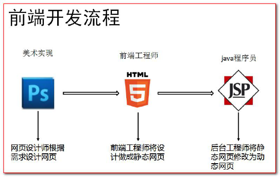
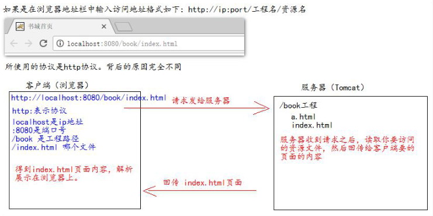
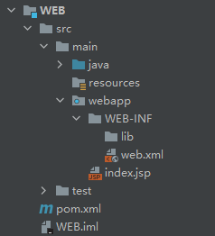
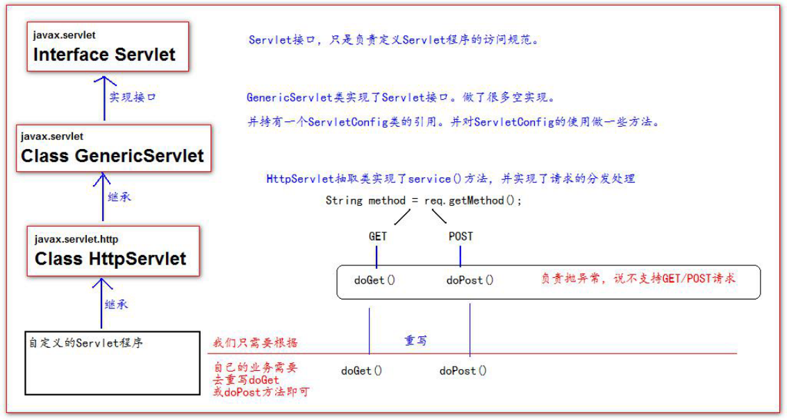
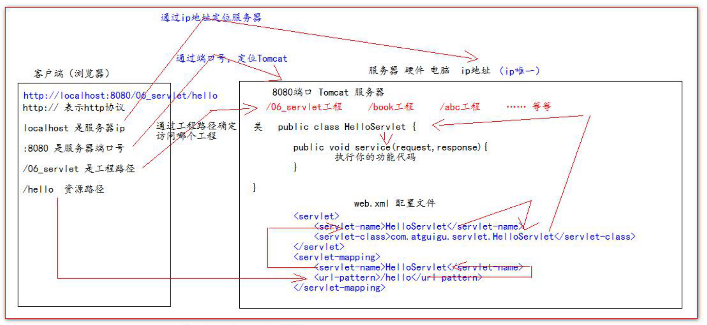
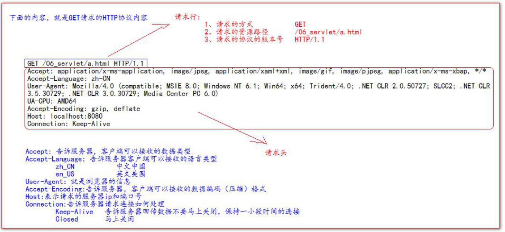

# Javaweb

Javaweb是指，所有通过Java语言编写可以通过浏览器访问的程序的总称。 Javaweb是基于请求(request)和响应(response)来开发的。


web资源按实现的技术和呈现的效果的不同，又分为静态资源和动态资源两种。 静态资源：html、css、js、txt、mp4视频,jpg图片 动态资源：jsp页面、Servlet程序。

在web中路径分为相对路径和绝对路径：

1. 相对路径：

   - .						 表示当前文件所在目录
   - ..                        表示当前文件所在的上一级目录
   - 文件名			  表示当前文件所在目录的文件，相当于./文件名	./可以省略 

2. 绝对路径：

   http://ip:port/工程名/资源路径

# 一、前端相关技术



页面由三部分组成：

- 内容(结构)：在页面中可以看到的数据。一般使用**html**技术来展示。
- 表现：内容在页面上的表现形式，如布局，颜色，大小等。一啊不能使用**CSS**技术实现。
- 行为：页面中元素与输入设备交互的响应。一般使用**JavaScript**技术实现。

## 1.1.HTML&CSS

HTML：**H**yper **T**ext **M**arkup **L**anguage （超文本标记语言）

html通过标签来标记要显示的网页中的各个部分。

html内的注释为 <!-- -->（jsp的注释为<%-- --%>）

### 1.1.1.html常用标签

1. 标题标签：h1到h6。

2. 超链接：

   ```html
   <a href="http://www.baidu.com">百度</a>
   ```

3. 列表标签：ul为无序列表,type属性修改列表项前面符号；li为列表项

   ```html
   <ul type="none">
       <li>一</li>
       <li>二</li>
   </ul>
   ```

4. 图片标签：img

   src属性设置图片的路径，width属性设置图片的宽度，height属性设置图片的高度，border属性设置图片边框的大小，alt属性设置当指定路径找不到图片时，用来代替显示的图片文本内容。

5. 表格标签：table

   border属性设置表格框大小，width属性设置表格宽度，height属性设置表格高度，align属性设置表格相对于页面对齐方式，cellspacing属性设置单元格间距。

   tr是行标签，th是表头标签，td是单元格标签；clospan属性可以设置跨列，rowspan属性设置跨行

   ```html
   <table>
       <tr>
           <th>第一列</th>
           <th>第二列</th>
       </tr>
       <tr>
           <td>第一列第一个值</td>
           <td>第二列第一个值</td>
       </tr>
       <tr>
           <td rowspan="2">第二行</td>
       </tr>
   </table>
   ```

6. **表单标签**：form

   input type=text     是文件输入框  value设置默认显示内容

   input type=password 是密码输入框  value设置默认显示内容

   input type=radio    是单选框    name属性可以对其进行分组   checked="checked"表示默认选中

   input type=checkbox 是复选框   checked="checked"表示默认选中

   input type=reset    是重置按钮      value属性修改按钮上的文本

   input type=submit   是提交按钮      value属性修改按钮上的文本

   input type=button   是按钮          value属性修改按钮上的文本

   input type=file     是文件上传域

   input type=hidden   是隐藏域    当我们要发送某些信息，而这些信息，不需要用户参与，就可以使用隐藏域(提交的时候同时发送给服务器)

   select 标签是下拉列表框，option 标签是下拉列表框中的选项 selected="selected"设置默认选中

   textarea表示多行文本输入框（起始标签和结束标签中的内容为默认值），rows属性设置可以显示几行的高度，cols属性设置每行可以显示几个字符宽度。

   ```html
   <form>
       用户名称：<input type="text" value="默认值"/><br>
       用户密码：<input type="password" vlaue="abc"/><br>
       确认密码：<input type="password" vlaue="abc"/><br>
       性别：<input type="radio" name="sex" checked="checked"/>男
       	 <input type="radio" name="sex"/>女<br>
       兴趣爱好：<input type="checkbox" checked="checked"/>JavaScript
       		<input type="checkbox" checked="checked"/>java
       		<input type="checkbox"/>c++<br>
       国籍：<select>
       		<option>--请选择国籍--</option>
               <option selected="selected">中国</option>
               <option>美国</option>
               <option>小日本</option>
            </select><br>
       自我评价：<textarea rows="10" cols="20">我才是默认值</textarea>
       <input type="reset" />
   </form>
   ```

7. 其他标签：div，span，p，font

   div表示独占一行，span标签的长度是封装数据的长度，p默认在段落的上方或下方各空出一行(如果已有就不再孔)，font字体标签。

### 1.1.2.CSS

CSS 是「层叠样式表单」。是用于(增强)控制网页样式并允许**将样式信息与网页内容分离**的一种标记性语言。

1. css与html结合的方式：

   - 在html标签的 style 属性上设置”key:value value;”，修改标签样式。

     缺点：如果标签多了，样式多了，代码量非常庞大；可读性非常差；css 代码没什么复用性可方言。

   - 在 html的head 标签中，使用 style 标签来定义各种自己需要的 css 样式。

     缺点：只能在同一页面内复用代码，不能在多个页面中复用 css 代码；维护起来不方便，实际的项目中会有成千上万的页面，要到每个页面中去修改，工作量大。

   - 把 css 样式写成一个单独的 **css 文件**，再在html的head标签中使用**link标签**引入即可复用。（最常用方式）

     ```html
     <head>
         <link rel="stylesheet" type="test/css" href="./styles.css"/>
     </head>
     ```

2. css选择器：

   ​	a）标签名选择器；b）id选择器；c）class选择器；d）组合选择器

```html
<head>
    <style type="text/css">
        <!-- 标签名选择器 -->
        div{
            border:1px solid yellow;
            color:blue;
        }
        <!-- id选择器-->
        #id001{
            border:1px solid yellow;
            color:blue;
        }
        <!-- class选择器-->
        .class01{
            border:1px solid yellow;
            color:blue;
        }
        <!-- 组合选择器-->
        .class01,#id001{
            border:1px solid yellow;
            color:blue;
        }
    </style>
</head>
<body>
    <div>标签名选择器</div>
    <div id="id001">id选择器</div>
    <div class="class01">class选择器</div>
</body>
```

## 1.2.JavaScript&jQuery

### 1.2.1.JavaScript

Javascript 语言诞生主要是完成页面的数据验证。因此它运行在客户端，需要运行浏览器来解析执行 JavaScript 代码。

JS是弱类型，Java是强类型。弱类型就是类型可变，强类型定义变量是类型就已确定，不可变。其特点如下：

- 交互性（它可以做的就是信息的动态交互）
- 安全性（不允许直接访问本地硬盘）
- 跨平台性（只要是可以解释 JS的浏览器都可以执行，和平台无关）

1. **js与html结合方式**

   a）在head或者body标签中，使用script标签书写js代码

   b）使用script标签引入单独的js代码文件

   ```html
   <head>
       <script type="text/javascript" src="1.js"></script>
   </head>
   ```

2. 变量与数组

   Javascript 的变量类型：数值类型：number;字符串类型：string;对象类型：object;布尔类型：boolean;函数类型：function

   ​		特殊类型：undefined：未定义，所有js变量未赋于初始值的时候，默认值都是undefined;	null：空值；	NaN: Not a Number。非数字，非数值

   js中的定义变量格式：var 变量名;	var 变量名 = 值;

   js中的变量同样也有逻辑运算。==，===(全等于，除了做字面值比较外，还会比较二者数据类型)，&&，||，!。

   js中的数组定义方式：var 数组名 = [ ];

3. js中的函数

   - 函数定义方式：

     a）function 函数名(形参){ 函数体 }

     b）var 函数名 = function(形参){}

   - arguments隐形参数：就是在 function 函数中不需要定义，但却可以直接用来获取所有参数的变量，类似于java中的可变形参

4. **事件**

   onload加载完成事件；onclick单击事件；onblur失去焦点事件；onchange内容发生改变事件；onsubmit表单提交事件

   事件的注册分为静态注册和动态注册两种：

   ​	静态注册事件：通过 html 标签的事件属性直接赋于事件响应后的代码。

   ```html
   <head>
       function onclickFun(){}  
   </head>
   <body>
       <button onclick="onclickFun();">按钮1</button>
   </body>
   ```

   ​	动态注册事件：是指先通过 js 代码得到标签的 dom 对象，然后再通过 dom 对象.事件名 = function(){} 这种形式赋于事件响应后的代码。

   ```html
   <head>
       window.onload = function(){
       	var btnObj = document.getElementById("btn01");
       <!--document对象中有方法getElementById,getElementsByName,getElementsByTagName,createElement-->
       	btnObj.onclick = function(){}
       }
       <!--使用了jQuery后可将上述代码简化为-->
       $("#btn01").click(function(){
       });
   </head>
   <body>
       <button id="btn01">按钮1</button>
   </body>
   ```

5. DOM模型

   DOM 全称是 Document Object Model 文档对象模型，就是把文档中的标签，属性，文本，转换成为对象来管理。

### 1.2.2.JQuery

jQuery是指JavaScript和查询(Query)，它是辅助JavaScript开发的js类库。它的核心思想是write less,do more(写得更少,做得更多)，**简化js代码**。

- 使用jQuery必须要引入jQuery库

  ```html
  <script type="text/javascript" src="../script/jquery-1.7.2.js"></script>
  ```

- jQuery中的重点是**$()**核心函数

# 二、XML$Tomcat

## 2.1.XML

xml是可扩展的标记性语言。XML 被设计用来传输和存储数据，HTML 被设计用来显示数据。

xml的主要作用有：

- 用来保存数据，而且这些数据具有自我描述性
- 它还可以做为项目或者模块的配置文件
- 还可以做为网络传输数据的格式（现在 JSON 为主）。

## 2.3.Tomcat

Tomcat：由 Apache 组织提供的一种 Web 服务器，提供对 jsp 和 Servlet 的支持。它是一种轻量级的 javaWeb 容器（服务器），也是当前应用最广的 JavaWeb 服务器（免费）。

### 2.3.1.Tomcat的使用

#### a）目录介绍

bin：专门用来存放Tomcat服务器的可执行程序 

conf：专门用来存放Tocmat服务器的配置文件 

lib：专门用来存放Tomcat服务器的jar包 

logs：专门用来存放Tomcat服务器运行时输出的日记信息 

temp：专门用来存放Tomcdat运行时产生的临时数据 

webapps：专门用来存放部署的Web工程。 

work：是Tomcat工作时的目录，用来存放Tomcat运行时jsp翻译为Servlet的源码，和Session钝化的目录。

#### b）Tomcat服务器的启动与停止

启动方式一：找到Tomcat目录下的bin目录下的startup.bat文件，双击，就可以启动Tomcat服务器。

启动方式二：1、打开命令行 2、cd到你的Tomcat的bin目录下 3、敲入启动命令：catalinarun

测试Tomcat服务器启动成功：[http://localhost:8080](http://localhost:8080/)

停止三种方式：1、点击tomcat服务器窗口的x关闭按钮 2、把Tomcat服务器窗口置为当前窗口，然后按快捷键Ctrl+C 3、到找到Tomcat的bin录的目录下的shutdown.bat击就以止双击，就可以停止Tomcat务服务器

#### c）修改Tomcat端口号

Mysql默认的端口号是：3306 Tomcat默认的端口号是：8080 找到Tomcat目录下的conf目录，找到server.xml配置文件。

#### d）部署web工程到Tomcat中

方式一：只需要把web程目拷到工程的目录拷贝到Tomcat的webapps录目录下可即可。

方式二：找到Tomcat下的conf目录\Catalina\localhost\下,创建如下的配置文件：

```xml
<!--Context表示一个工程上下文
    path表示工程的访问路径:/abc
    docBase表示你的工程目录在哪里
-->
<Context path="/abc"docBase="E:\book"/>Copy to clipboardErrorCopied
```

访问方式：http://ip:port/工程名/目录下/文件名（localhost：8080）

#### e）file协议与http协议的区别




#### f）ROOT工程与默认访问

当我们在浏览器地址栏中输入访问地址如下： http://ip:port/====%3E%3E%3E%3E没有工程名的时候，默认访问的是ROOT工程。 当我们在浏览器地址栏中输入的访问地址如下： http://ip:port/工程名/====%3E%3E%3E%3E没有资源名，默认访问index.html页面

### 2.3.2.IDEA操作动态web工程

IDEA可以整合Tomcat服务器



src/main/java目录存放自己编写的java源代码

webapp目录存放web工程的资源文件，包括html页面，css、js文件等等

lib目录存放第三方jar包。(现在都用maven依赖导入)

WEB-INF目录是一个受服务器保护的目录，浏览器无法直接访问此内容。

web.xml是配置文件，配置web工程组件。如servlet程序、Filter过滤器、Listener监听器、session超时等等。

# 三、Servlet

Servlet简介：

- Servlet是JavaEE规范之一，规范就是接口。
- Servlet就JavaWeb三大组件之一。三大组件分别是：Servlet程序、Filter过滤器、Listener监听器。
- Servlet是运行在服务器上的一个java小程序，**它可以接收客户端发送过来的请求，并响应数据给客户端**。

## 3.1.Servlet技术

### 3.1.1.Servlet程序的实现与创建方式

1. **实现Servlet接口**

   1. 编写一个类去实现Servlet接口
   2. 实现service方法，处理请求（Get(**会在地址栏显示参数**)或者Post请求），并响应数据
   3. 到web.xml中去配置servlet程序的访问地址

   ```java
   public class HelloServlet implements Servlet {
       @Override
       /**
        * @param servletRequest:
        * @param servletResponse:
        * @return void:
        * @Description: 专门用来处理请求和响应
        */
       public void service(ServletRequest servletRequest, ServletResponse servletResponse) throws ServletException, IOException {
           //类型转换（因为它有getMethod()方法）
           HttpServletRequest httpServletRequest = (HttpServletRequest) servletRequest;
           //获取请求的方式
           String method = httpServletRequest.getMethod();
           if ("GET".equals(method)) {
               doGet();
           } else if ("POST".equals(method)) {
               doPost();
           }
       }
   }
   ```

   其中web.xml中的内容为：

   ```xml
   <!--servlet标签给Tomcat配置servlet程序-->
   <servlet>
       <!--别名，一般是类名-->
       <servlet-name>HelloServlet</servlet-name>
       <!--servlet全类名-->
       <servlet-class>HelloServlet</servlet-class>
   </servlet>
   
   <!--servlet-mapping标签给servlet程序配置访问地址-->
   <servlet-mapping>
       <!--配置地址给哪个Servlet程序使用-->
       <servlet-name>HelloServlet</servlet-name>
       <!--配置访问地址(自定义的，与servlet程序有关)
       http://ip:port/工程路径/hello
       -->
       <url-pattern>/hello</url-pattern>
   </servlet-mapping>
   ```

2. **继承HttpServlet类**

   一般在实际项目开发中，都是使用继承HttpServlet类的方式去实现Servlet程序：

   1. 编写一个类去继承HttpServlet类
   2. 根据业务需要重写doGet或doPost方法
   3. 到web.xml中的配置Servlet程序的访问地址

   ```java
   public class HelloServlet extends HttpServlet {
       @Override
       protected void doGet(HttpServletRequest request, HttpServletResponse response) throws ServletException, IOException {
           System.out.println("HelloServlet2的doGet方法");
       }
   
       @Override
       protected void doPost(HttpServletRequest request, HttpServletResponse response) throws ServletException, IOException {
           System.out.println("HelloServlet2的doPost方法");
       }
   }
   ```

3. **IDEA生成创建**

   NEW -> Servlet，生成的结构与程序2相同，也得配置web.xml文件

### 3.1.2.Servlet的继承体系



### 3.1.3.Servlet的访问机理与生命周期



1、执行Servlet构造器方法 2、执行init初始化方法 

第一、二步，是在第一次访问，的时候创建Servlet程序会调用。 

3、执行service方法 

第三步，每次访问都会调用。 

4、执行destroy销毁方法 

第四步，在web工程停止的时候调用。

## 3.2.ServletConfig类

ServletConfig是 Servlet 程序的配置信息类。

Servlet 程序和 ServletConfig 对象都是由 Tomcat 负责创建，我们负责使用。Servlet 程序默认是第一次访问的时候创建，ServletConfig 是每个 Servlet 程序创建时，就创建一个对应的 ServletConfig 对象。

- Servlet 规范将Servlet 的配置信息全部封装到了 ServletConfig **接口**对象中。
- 在tomcat调用 init()方法时，首先会将 web.xml 中当前 Servlet 类的配置信息封装为一个对象。
- 这个对象的类型实现了 ServletConfig 接口， Web 容器会将这个对象传递给init()方法中的 ServletConfig 参数。
- 每个Servlet程序创建时，就创建一个对应的ServletConfig对象。

三个作用：

1. 可以获取Servlet程序的别名servlet-name的值
2. 获取初始化参数init-param（单个Servlet程序单独的）
3. 获取ServletContext对象

web.xml中的配置：

```xml
<!--servlet标签给Tomcat配置servlet程序-->
<servlet>
    <!--别名，一般是类名-->
    <servlet-name>HelloServlet</servlet-name>
    <!--servlet全类名-->
    <servlet-class>HelloServlet</servlet-class>
    <!--初始化参数-->
    <init-param>
        <param-name>username</param-name>
        <param-value>host</param-value>
    </init-param>
    <init-param>
        <param-name>url</param-name>
        <param-value>jdbc:mysql://localhost:3306/test</param-value>
    </init-param>
</servlet>
<!--servlet-mapping标签给servlet程序配置访问地址-->
<servlet-mapping>
    <!--配置地址给哪个Servlet程序使用-->
    <servlet-name>HelloServlet</servlet-name>
    <!--配置访问地址(自定义的，与servlet程序有关)
    http://ip:port/工程路径/hello
    -->
    <url-pattern>/hello</url-pattern>
</servlet-mapping>
```

演示代码：

```java
public void init(ServletConfig servletConfig) throws ServletException {
    System.out.println("2.init初始化");

    //1、可以获取Servlet程序的别名servlet-name的值
    System.out.println("servlet程序别名是" + servletConfig.getServletName());
    //2、获取初始化参数init-param
    System.out.println("username的值是" +                  servletConfig.getInitParameter("username"));
    //3、获取ServletContext对象
    System.out.println(servletConfig.getServletContext());
}
```

## 3.3.ServletContext类

- 服务器会为每一个工程创建一个Servlet上下文对象，这个对象就是ServletContext接口的对象实例。
- 这个对象全局唯一，而且工程内部的所有servlet都共享这个对象。所以叫全局应用程序共享对象。
- web工程部署启动的时候创建，在web工程停止的时候销毁。

四个作用：

1. 获取web.xml中配置的上下文参数context-param
2. 获取当前的工程路径，格式:/工程路径
3. 获取工程部署后在服务器硬盘上的绝对路径
4. 像Map一样存取数据

web.xml中的配置：

```xml
<!--上下文参数，属于整个web工程-->
<context-param>
    <param-name>username</param-name>
    <param-value>context</param-value>
</context-param>
```

演示代码：

```java
protected void doGet(HttpServletRequest request, HttpServletResponse response) throws ServletException, IOException {
    System.out.println("HelloServlet的doGet函数");
    //1、获取web.xml中配置的上下文参数context-param
    ServletContext context = getServletConfig().getServletContext();
    String username = context.getInitParameter("username");
    System.out.println(username);//context
    //2、获取当前的工程路径，格式:/工程路径
    System.out.println("当前的工程路径" + context.getContextPath());
    //3、获取工程部署后在服务器硬盘上的绝对路径（out文件夹）
    //映射到web目录
    //"/":被解析为http://ip:port/工程名/
    System.out.println("工程部署后在服务器硬盘上的绝对路径" + context.getRealPath("/"));
    //4、像Map一样存取数据
    context.setAttribute("key1", "value1");
    System.out.println(context.getAttribute("key1"));
}
```

## 3.4 HTTP协议

### 3.4.1.HTTP协议内容

超文本传输协议（Hyper Text Transfer Protocol，*HTTP*）是一个简单的请求-响应协议，它通常运行在TCP之上。它指定了客户端可能发送给服务器什么样的消息以及得到什么样的响应。

客户端给服务器发送数据叫请求。 服务器给客户端回传数据叫响应。

### 3.4.2请求的HTTP协议格式

**GET请求：**

1、请求行 (1)请求的方式 GET (2)请求的资源路径[+?+请求参数] (3)请求的协议的版本号 HTTP/1.1 

2、请求头 key:value 组成不同的键值对，表示不同的含义。



**POST请求：**

 1、请求行 (1)请求的方式 POST (2)请求的资源路径[+?+请求参数] (3)请求的协议的版本号 HTTP/1.1

 2、请求头 1)key:value 不同的请求头，有不同的含义

 **空行**

 3、请求体 ===>>> 就是发送给服务器的数据


**GET请求有哪些：**

- 1、form标签method=get
- 2、a标签,超链接
- 3、link标签引入css
- 4、Script标签引入js文件
- 5、img标签引入图片
- 6、iframe引入html页面
- 7、在浏览器地址栏中输入地址后敲回车

**POST请求有哪些：**

- 8、form标签method=post

**常用的请求头的说明：**

- Accept: 表示客户端可以接收的数据类型
- Accpet-Languege: 表示客户端可以接收的语言类型
- User-Agent: 表示客户端浏览器的信息
- Host： 表示请求时的服务器 ip 和端口号

### 3.4.3.响应的HTTP协议格式

 1、响应行 (1)响应的协议和版本号 (2)响应状态码 (3)响应状态描述符

 2、响应头 (1)key:value 不同的响应头，有其不同含义

 空行

 3、响应体 ---->>> 就是回传给客户端的数据


**常用的响应码：**

- 200表示请求成功
- 302表示请求重定向
- 404表示请求服务器已经收到了，但是你要的数据不存在（请求地址错误）
- 500表示服务器已经收到请求，但是服务器内部错误（代码错误）

### 3.4.4.MIME类型

- MIME是HTTP协议中数据类型。
- MIME的英文全称是"MultipurposeInternetMailExtensions"多功能Internet邮件扩充服务。
- MIME类型的格式是“大类型/小类型”，并与某一种文件的扩展名相对应。


## 3.5.HttpServletRequest类

HttpServletRequest对象代表客户端的请求，当客户端通过HTTP协议访问服务器时（**每次**请求进入Tomcat服务器），Tomcat服务器将HTTP请求头中的所有信息都封装在**HttpServletRequest对象**中，然后传递到service方法（doGet和doPost）中给我们使用，通过这个对象提供的方法，可以获得客户端请求的所有信息。

### 3.5.1.HttpServletRequest对象的常用方法

- getRequestURI()获取请求的资源路径
- getRequestURL()获取请求的统一资源定位符（绝对路径）
- getRemoteHost()获取客户端的ip地址
- getHeader()获取请求头
  - getHeader("Referer")获取请求的完整地址
- getParameter()获取请求的参数
- getParameterValues()获取请求的参数（多个值的时候使用）
- getMethod()获取请求的方式GET或POST
- setAttribute(key,value);设置域数据
- getAttribute(key);获取域数据
- getRequestDispatcher()获取请求转发对象
- getContextPath获取工程名路径
- getSession();获取Session对话

```java
protected void doGet(HttpServletRequest request, HttpServletResponse response) throws ServletException, IOException {
    System.out.println("HelloServlet的doGet函数");

    //i.getRequestURI()获取请求的资源路径
    System.out.println(request.getRequestURI());
    //ii.getRequestURL()获取请求的统一资源定位符（绝对路径）
    System.out.println(request.getRequestURL());
    //iii.getRemoteHost()获取客户端的ip地址
    System.out.println(request.getRemoteHost());
    //iv.getHeader()获取请求头
    System.out.println(request.getHeader("User-Agent"));
    //vii.getMethod()获取请求的方式GET或POST
    System.out.println(request.getMethod());
    //v.getParameter()获取请求的参数
    System.out.println("用户名" + request.getParameter("username"));
    System.out.println("密码" + request.getParameter("password"));
    System.out.println("兴趣爱好" + Arrays.asList(request.getParameterValues("hobby")));
    //vi.getParameterValues()获取请求的参数（多个值的时候使用）
}
```

表单：

```html
<body>
    <form action="http://localhost:8080/07_servlet/parameterServlet" method="get">
        用户名：<inputtype="text" name="username"><br/>
        密码：<inputtype="password" name="password"><br/>
        兴趣爱好：<inputtype="checkbox" name="hobby" value="cpp">C++
        <inputtype="checkbox" name="hobby" value="java">Java
        <inputtype="checkbox" name="hobby" value="js">JavaScript<br/>
        <inputtype="submit">
    </form>
</body>
```

乱码解决：

```java
//GET请求的中文乱码解决
username = newString(username.getBytes("iso-8859-1"),"UTF-8");
//POST请求的中文乱码解决
request.setCharacterEncoding("UTF-8");
```

### 3.5.2.请求的转发

请求转发是指，服务器收到请求后，从一次资源跳转到另一个资源的操作叫请求转发。（一个Servlet程序跳转到另外一个Servlet程序）


Servlet1代码：

```java
public class Servlet1 extends HttpServlet {
    @Override
    protected void doGet(HttpServletRequest request, HttpServletResponse response) throws ServletException, IOException {
        //获取请求参数
        String username = request.getParameter("username");
        System.out.println("Servlet1中");
        //与ServletContext区别开
        request.setAttribute("key","Servlet1");
        //请求转发以"/"开头，即要转发的servlet程序在web.xml中的配置
        RequestDispatcher requestDispatcher = request.getRequestDispatcher("/servlet2");
        //转发到Servlet2
        requestDispatcher.forward(request,response);
    }

    @Override
    protected void doPost(HttpServletRequest request, HttpServletResponse response) throws ServletException, IOException {

    }
}
```

Servlet2代码：

```java
public class Servlet2 extends HttpServlet {
    @Override
    protected void doGet(HttpServletRequest request, HttpServletResponse response) throws ServletException, IOException {
        //获取请求参数
        String username = request.getParameter("username");
        System.out.println("Servlet2中");

        Object key = request.getAttribute("key");
        System.out.println(key);
    }

    @Override
    protected void doPost(HttpServletRequest request, HttpServletResponse response) throws ServletException, IOException {

    }
}
```

### 3.5.3.base标签与相对、绝对路径

- **请求转发的forwardC是一个Servlet程序**


- **base标签解决请求转发跳转错误问题：**

```html
<!DOCTYPEhtml>
<html lang="zh_CN">
<head>
    <meta charset="UTF-8">
    <title>Title</title>
    <!--base标签设置页面相对路径工作时参照的地址
        href属性就是参数的地址值
    -->
    <base href="http://localhost:8080/07_servlet/a/b/">
</head>
<body>
    这是a下的b下的c.html页面<br/>
<a href="../../index.html">跳回首页</a><br/>
</body>
</html>Copy to clipboardErrorCopied
```

- **在web中路径分为相对路径和绝对路径：**

  1. 相对路径：

     - .						 表示当前文件所在目录
     - ..                        表示当前文件所在的上一级目录
     - 文件名			  表示当前文件所在目录的文件，相当于./文件名	./可以省略 

  2. 绝对路径：

     http://ip:phttp://ip:port/工程名/资源路径

### 3.5.4.web中 / 的不同意义

在web中/斜杠是一种绝对路径。

 /斜杠如果被浏览器解析，得到的地址是：http://ip:port/

```html
<!--html-->
<a href="/">斜杠</a>
```

 /斜杠如果被服务器解析，得到的地址是：http://ip:port/工程路径

```java
//java
servletContext.getRealPath(“/”);
request.getRequestDispatcher(“/”);
<!--xml-->
<url-pattern>/servlet1</url-pattern>
```

## 3.6 HTTPServletResponse类

- 每次请求进来，Tomcat服务器都会创建一个Response对象传递给Servlet程序去使用
- HttpServletRequest表示请求过来的信息，HttpServletResponse表示所有响应的信息
- 我们如果需要设置返回给客户端的信息，都可以通过HttpServletResponse对象来进行设置

### 3.6.1.输出流与回传数据

- 字节流 getOutputStream(); 常用于下载（传递二进制数据）
- 字符流 getWriter(); 常用于回传字符串（常用）
- 往客户端（浏览器）回传字符

```java
protected void doGet(HttpServletRequest request, HttpServletResponse response) throws ServletException, IOException {
    
    //解决乱码，设置服务器和浏览器字符集
    //同时设置服务器和客户端都使用UTF-8字符集，还设置了响应头
    response.setContentType("text/html; charset=UTF-8");

    PrintWriter writer = response.getWriter();
    writer.write("中文response'scontent!!!");
}Copy to clipboardErrorCopied
```

### 3.6.2.请求重定向

请求重定向，是指客户端给服务器发请求，然后服务器告诉客户端去新地址访问（因为之前的地址可能已经被废弃）。**注意与请求转发区别开来**。

请求转发会保留req和resp的信息，而重定向不会。


Response1代码示例：

```java
protected void doGet(HttpServletRequest request, HttpServletResponse response) throws ServletException, IOException {
    System.out.println("Response1");

    //方式一：
    //设置响应状态码302重定向
    //response.setStatus(302);
    //重定向地址
  //response.setHeader("Location","http://localhost:8080/01_servlet/response2");

    //方式二：
    response.sendRedirect("http://localhost:8080/01_servlet/response2");
}Copy to clipboardErrorCopied
```

Response2代码示例：

```java
protected void doGet(HttpServletRequest request, HttpServletResponse response) throws ServletException, IOException {
    System.out.println("Response2");
}
```

### 3.6.3.响应和请求的乱码解决

1. 请求的乱码解决

   ```java
   //GET请求的中文乱码解决
   username = newString(username.getBytes("iso-8859-1"),"UTF-8");
   //POST请求的中文乱码解决
   request.setCharacterEncoding("UTF-8");
   ```

2. 响应的乱码解决

   ```java
   // 它会同时设置服务器和客户端都使用 UTF-8字符集，还设置了响应头
   // 此方法一定要在获取流对象之前调用才有效
   resp.setContentType("text/html; charset=UTF-8");
   ```

   

# 四、JSP

- jsp 的全称是 java server pages。Java 的服务器页面。
- jsp 的主要作用是代替 Servlet 程序回传 html 页面的数据，和 html 页面一样，都是存放在 web 目录下。访问也跟访问 html 页面一样。
- 因为 Servlet 程序回传 html 页面数据是一件非常繁锁的事情，开发成本和维护成本都极高。


**jsp 回传一个简单 html 页面的代码：**

```jsp
<%@ page contentType="text/html;charset=UTF-8" language="java" %> <html> 
    <head> 
        <title>Title</title> 
    </head> 
    <body> 
        这是 html 页面数据 
    </body> 
</html>
```

**jsp本质：**

- jsp 页面本质上是一个 Servlet 程序。
- 当我们第一次访问 jsp 页面的时候，Tomcat 服务器会帮我们把 jsp 页面翻译成为一个 java 源文件，并且对它进行编译成 为.class 字节码程序。
- jsp 翻译出来的 java 类，它间接了继承了HttpServlet 类。
- 其底层实现，也是通过输出流，把 html 页面数据回传 给客户端（ **_jspService方法**）。

## 4.1.jsp语法

### 4.1.1.jsp头部的page指令

jsp 的 page 指令可以修改 jsp 页面中一些重要的属性，或者行为。

```jsp
<%@ page contentType="text/html;charset=UTF-8" language="java" %>Copy to clipboardErrorCopied
```

| language 属性     | 表示 jsp 翻译后是什么语言文件。暂时只支持 java。             |
| ----------------- | ------------------------------------------------------------ |
| contentType 属性  | 表示 jsp 返回的数据类型是什么。也是源码中 response.setContentType()参数值 |
| pageEncoding 属性 | 表示当前 jsp 页面文件本身的字符集。                          |
| import 属性       | 跟 java 源代码中一样。用于导包，导类。                       |
| autoFlush 属性    | 设置当 out 输出流缓冲区满了之后，是否自动刷新冲级区。默认值是 true。 |
| buffer 属性       | 设置 out 缓冲区的大小。默认是 8kb                            |
| errorPage 属性    | 设置当 jsp 页面运行时出错，自动跳转去的错误页面路径。这 个 路 径 一 般 都 是 以 斜 杠 打 头 ， 它 表 示 请 求 地 址 为 http://ip:port/ 工 程 路 径 /，映 射 到 代 码 的 Web目 录 |
| isErrorPage 属性  | 设置当前 jsp 页面是否是错误信息页面。默认是 false。如果是 true 可以 获取异常信息。 |
| session 属性      | 设置访问当前 jsp 页面，是否会创建 HttpSession 对象。默认是 true。 |
| extends 属性      | 设置 jsp 翻译出来的 java 类默认继承谁。                      |

### 4.1.2.jsp的脚本

#### a）声明脚本(极少使用)

声明脚本的格式是： **<%! 声明 java 代码 %>**

作用：可以给 jsp 翻译出来的 java 类定义属性和方法甚至是静态代码块。内部类等。

```jsp
<%--1、声明类属性--%>
    <%!
        private Integer id;
        private String name;
        private static Map<String,Object> map;
    %>
    <%--2、声明 static 静态代码块--%>
    <%!
        static {
            map = new HashMap<String,Object>();
            map.put("key1", "value1");
            map.put("key2", "value2");
            map.put("key3", "value3");
        }
    %>
    <%--3、声明类方法--%>
    <%!
        public int abc(){
            return 12;
        }
    %><%--4、声明内部类--%>
    <%!
        public static class A {
            private Integer id = 12;
            private String abc = "abc";
        }
    %>
```

#### b）表达式脚本

表达式脚本的格式是：**<%=表达式%>**

表达式脚本的作用是：**在 jsp 页面上输出数据。**

表达式脚本的特点：

1. 所有的表达式脚本都会被**翻译到_jspService() 方法中**
2. 表达式脚本都会被**翻译成为 out.print()输出到页面上**
3. 由于表达式脚本翻译的内容都在 _jspService() 方法中,所以_jspService()方法中的对象都可以直接使用。
4. 表达式脚本中的表达式不能以分号结束。

```jsp
<%=12 %> <br> 
<%=12.12 %> <br> 
<%="我是字符串" %> <br> 
<%=map%> <br> 
<%=request.getParameter("username")%>
```

#### c）代码脚本

代码脚本的格式是： **<% java 语句 %>**

代码脚本的作用是：**可以在 jsp 页面中，编写我们自己需要的功能（写的是 java 语句）。**

代码脚本的特点是：

1、代码脚本翻译之后都在_jspService 方法中

2、代码脚本由于**翻译到_jspService()方法**中，所以在_jspService()方法中的现有对象都可以直接使用。

3、还可以由多个代码脚本块组合完成一个完整的 java 语句。

4、**代码脚本还可以和表达式脚本一起组合使用**，在 jsp 页面上输出数据


### 4.1.3.jsp的注释

#### a）html注释

```jsp
<!--这 是 html注 释-->
```

html 注释会被翻译到 java 源代码中，在_jspService 方法里，以 out.writer 输出到客户端，成为**网页页面源码的注释**。

#### b）java注释

```jsp
<%
    //单 行 java注 释
    /*多 行 java注 释*/
%>
```

java 注释会被翻译到 java 源代码中。

#### c）jsp注释

```jsp
<%--这是jsp注释--%>
```

## 4.2.jsp九大内置对象

是指 Tomcat 在翻译 jsp 页面成为 Servlet 源代码后，内部提供的九大对象。


## 4.3.jsp四大域对象

| pageContext | PageContextImpl类    | 当前 jsp 页面范围内有效                                    |
| ----------- | -------------------- | ---------------------------------------------------------- |
| request     | HttpServletRequest类 | 一次请求内有效                                             |
| session     | HttpSession类        | 一个会话范围内有效（打开浏览器访问服务器，直到关闭浏览器） |
| application | ServletContext类     | 整个 web 工程范围内都有效（只要 web 工程不停止，数据都在） |

域对象是可以像 Map 一样存取数据的对象，优先顺序从小到大：

pageContext ====>>> request ====>>> session ====>>> application

**scope.jsp 页面**

```jsp
<body> 
    <h1>scope.jsp 页面</h1> 
    <% // 往 四 个 域 中 都 分 别 保 存 了 数 据 
    pageContext.setAttribute("key", "pageContext"); 
    request.setAttribute("key", "request"); 
    session.setAttribute("key", "session"); 
    application.setAttribute("key", "application"); %> 
    pageContext 域是否有值：<%=pageContext.getAttribute("key")%> <br> 
    request 域是否有值：<%=request.getAttribute("key")%> <br> 
    session 域是否有值：<%=session.getAttribute("key")%> <br> 
    application 域是否有值：<%=application.getAttribute("key")%> <br> 
    <% request.getRequestDispatcher("/scope2.jsp").forward(request,response); %> 
</body>
```

**scope2.jsp 页面**

```jsp
<body> 
    <h1>scope2.jsp 页面</h1> 
    pageContext域是否有值：<%=pageContext.getAttribute("key")%> <br> 
    <%--pageContext域无值，只在当前jsp页面范围内有效--%>
    request域是否有值：<%=request.getAttribute("key")%> <br> 
    session域是否有值：<%=session.getAttribute("key")%> <br> 
    application域是否有值：<%=application.getAttribute("key")%> <br> 
</body>
```

## 4.4.out与response.getWriter输出


jsp 翻译之后，底层源代码都是使用 out 来进行输出：

- out.write() 输出字符串没有问题
- out.print() 输出任意数据都没有问题（都转换成为字符串后调用的 write() 输出）

**在 jsp 页面中，可以统一使用 out.print()来进行输出**

## 4.5.jsp常用标签

### 4.5.1.jsp静态包含(常用)


**<%@include file=""%> 就是静态包含** file属性指定你要包含的jsp页面的路径 地址中第一个斜杠/表示为http://ip:port/工程路径/映射到代码的web目录

静态包含的特点：

1. 静态包含不会翻译被包含的jsp页面（**不生成单独的java程序**）。
2. 静态包含其实是把被包含的jsp页面的代码拷贝到包含的位置执行输出。

```jsp
<%@ include file="/include/footer.jsp"%>
```

### 4.5.2.jsp动态包含(少用)

**<jsp:include page=""></jsp:include>**这是动态包含

动态包含也可以像静态包含一样。把被包含的内容执行输出到包含位置

动态包含的特点：

1. 动态包含会把包含的jsp页面也翻译成为java代码
2. 动态包含底层代码使用如下代码去调用被包含的jsp页面执行输出。JspRuntimeLibrary.include(request,response,"/include/footer.jsp",out,false);
3. 动态包含，还可以传递参数

```jsp
<jsp:include page="/include/footer.jsp"> 
    <jsp:param name="username" value="bbj"/> 
    <jsp:param name="password" value="root"/> 
</jsp:include>
```

**动态包含的底层原理：**


### 4.5.3.二种包含的区别

在工作中，几乎都是使用静态包含。理由很简单。因为 jsp 页面虽然可以写 java 代码，做其他的功能操作。但是由于 jsp 在开发过程中被定位为专门用来展示页面的技术。也就是说。jsp 页面中，基本上只有 html，css，js。还有一些简单的 EL，表达式脚本等输出语句。所以我们都使用静态包含。

|                     | 静态包含                                                     | 动态包含                            |
| ------------------- | ------------------------------------------------------------ | ----------------------------------- |
| 是否生成java文件    | 不生成                                                       | 生成                                |
| service方法中的区别 | 把包含的内容原封拷贝到service中                              | JspRuntimeLibrary.include 方法      |
| 是否可以传递参数    | 不能                                                         | 可以                                |
| 编译次数            | 1                                                            | 包含的文件 + 1                      |
|                     | 适用包含纯静态内容(CSS,HTML,JS)，或没有非常耗时操作。或大量 java 代码的 jsp | 包含需要传递参数。含有大量 java代码 |

### 4.5.4.jsp请求转发

**<jsp:forward page=""></jsp:forward>**是请求转发标签 ，它的功能就是请求转发

page属性设置请求转发的路径

```jsp
<jsp:forward page="/scope2.jsp"></jsp:forward>
```

## 4.6.Listener监听器

- Listener 监听器它是 JavaWeb 的三大组件之一。JavaWeb 的三大组件分别是：Servlet程序、Filter过滤器、Listener监听器。
- Listener 它是 JavaEE 的规范，就是**接口**
- 监听器的作用是，**监听某种事物的变化。然后通过回调函数，反馈**给客户（程序）去做一些相应的处理。

**ServletContextListener 监听器:**

- ServletContextListener 它可以监听 ServletContext 对象的创建和销毁。
- ServletContext 对象在 web 工程启动的时候创建，在 web 工程停止的时候销毁。
- 监听到创建和销毁之后都会分别调用 ServletContextListener 监听器的方法反馈。
- **使用 ServletContextListener 监听器监听 ServletContext 对象使用步骤：**
  1. 编写一个类去实现 ServletContextListener
  2. 实现其两个回调方法
  3. 到 web.xml 中去配置监听器

**监听器实现类：**

```java
public class MyServletContextListenerImpl implements ServletContextListener {
    @Override
    public void contextInitialized(ServletContextEvent servletContextEvent) {
        System.out.println("ServletContext对象被创建了");
    }

    @Override
    public void contextDestroyed(ServletContextEvent servletContextEvent) {
        System.out.println("ServletContext对象被销毁了");
    }
}Copy to clipboardErrorCopied
```

**web.xml 中的配置：**

```xml
<listener>
    <listener-class>MyServletContextListenerImpl</listener-class>
</listener>
```

# 五、EL表达式@JSTL标签库

EL 表达式主要是为了替换 jsp 中的表达式脚本，而标签库则是为了替换代码脚本。这样使得整个 jsp 页面变得更佳简洁。

## 5.1.EL表达式

EL 表达式的全称是：Expression Language，表达式语言。其作用主要是代替 jsp 页面中的表达式脚本在 jsp 页面中进行数据的输出，因为 EL 表达式在输出数据的时候，要比 jsp 的表达式脚本要简洁很多。

```jsp
<body> 
    <%
        request.setAttribute("key","值");
    %> 
    表达式脚本输出 key 的值是： <%=request.getAttribute("key1")==null?"":request.getAttribute("key1")%><br/> 
    EL表达式输出 key 的值是：${key1} 
</body>
```

**EL 表达式的格式是：${表达式}**

EL 表达式在输出 null 值的时候，输出的是空串。jsp 表达式脚本输出 null 值的时候，输出的是 null 字符串。

### 5.1.1.EL 表达式搜索域数据的顺序

EL 表达式主要是在 jsp 页面中输出数据，**主要是输出域对象中的数据。**

当四个域中都有相同的 key 的数据的时候，EL 表达式会按照四个域的从小到大的顺序去进行搜索，找到就输出。

```jsp
<body> 
    <%
        // 往四个域中都保存了相同的key的数据，最后输出pageContext的内容。 
        request.setAttribute("key", "request");
        session.setAttribute("key", "session"); 
        application.setAttribute("key", "application"); 
        pageContext.setAttribute("key", "pageContext");
    %> 
    ${ key }
</body>
```

### 5.1.2.EL表达式的输出&运算

**a）输出**Person 类（JavaBean）中普通属性，数组属性。list 集合属性和 map 集合属性。**需要实现get方法，才能使用EL表达式输出。**

```jsp
<%
    Person person = new Person();
    person.setName("国哥好帅！");
    person.setPhones(new String[]{"18610541354", "18688886666", "18699998888"});
    List<String> cities = new ArrayList<String>();
    cities.add("北京");
    cities.add("上海");
    cities.add("深圳");
    person.setCities(cities);
    Map<String, Object> map = new HashMap<>();
    map.put("key1", "value1");
    map.put("key2", "value2");
    map.put("key3", "value3");
    person.setMap(map);
    application.setAttribute("p", person);
%>
输出 Person：${ p }<br/>
输出 Person 的 name 属性：${p.name} <br>
输出 Person 的 pnones 数组属性值：${p.phones[2]} <br>
输出 Person 的 cities 集合中的元素值：${p.cities} <br>
输出 Person 的 List 集合中个别元素值：${p.cities[2]} <br>
输出 Person 的 Map 集合: ${p.map} <br>
输出 Person 的 Map 集合中某个 key 的值: ${p.map.key3} <br>
```

**b）语法：${ 运算表达式 }**

- 关系运算（true或false）

- 逻辑运算（true或false）

- 算数运算（值）

- empty 运算

  empty 运算可以判断一个数据是否为空，如果为空，则输出 true,不为空输出 false。

  以下几种情况为空： 1、值为 **null 值**的时候，为空 2、值为**空串**的时候，为空 3、值是 Object 类型数组，**长度为零**的时候 4、list 集合，**元素个数为零** 5、map 集合，**元素个数为零**

  ```jsp
  <%
      request.setAttribute("emptyNull", null); 
  %>
  ${ empty emptyNull} <br/>
  ```

- 三元运算

  表达式 1？表达式 2：表达式 3

  ```jsp
  ${ 12 != 12 ? "111":"222" }
  ```

- “.”点运算 和 [] 中括号运算符

  .点运算，可以输出 Bean 对象中某个属性的值。

  []中括号运算，可以输出有序集合中某个元素的值，还可以输出 map 集合中 key 里含有特殊字符的 key 的值。

  ```jsp
  <body> 
      <%
          Map<String,Object> map = new HashMap<String, Object>(); 
          map.put("a.a.a", "aaaValue"); 
          map.put("b+b+b", "bbbValue"); 
          map.put("c-c-c", "cccValue");
  
          request.setAttribute("map", map);
      %>
      ${ map['a.a.a'] } <br> 
      ${ map["b+b+b"] } <br> 
      ${ map['c-c-c'] } <br>
  </body>
  Copy to clipboardErrorCopied
  ```

### 5.1.3.EL表达式的11个隐含对象

11个隐含对象是EL 表达式中自己定义的，可以直接使用。

| 变量             | 类型               | 作用                                             |
| ---------------- | ------------------ | ------------------------------------------------ |
| pageContext      | PageContextImpl    | 获取 jsp 中的九大内置对象                        |
| pageScope        | Map<String,Object> | 获取 pageContext 域中的数据                      |
| requestScope     | Map<String,Object> | 获取 Request 域中的数据                          |
| sessionScope     | Map<String,Object> | 获取 Session 域中的数据                          |
| applicationScope | Map<String,Object> | 获取 ServletContext 域中的数据                   |
| param            | Map<String,Object> | 获取请求参数的值                                 |
| paramValues      | Map<String,Object> | 获取请求参数的值，获取多个值的时候使用。         |
| header           | Map<String,Object> | 获取请求头的信息                                 |
| headerValues     | Map<String,Object> | 获取请求头的信息，它可以获取多个值的情况         |
| cookie           | Map<String,Object> | 获取当前请求的 Cookie 信息                       |
| initParam        | Map<String,Object> | 获取在 web.xml 中配置的<context-param>上下文参数 |

#### a）EL 获取四个特定域中的属性


```jsp
<body>
    <%
        pageContext.setAttribute("key1", "pageContext1");
        pageContext.setAttribute("key2", "pageContext2");
        request.setAttribute("key2", "request");
        session.setAttribute("key2", "session");
        application.setAttribute("key2", "application");
    %>
    ${ applicationScope.key2 }
    ${ requestScope.key2 }
    ${ sessionScope.key2 }
    ${ pageScope.key2 }
</body>
```

#### b）pageContext 对象的使用

该pageContext与JSP内置对象pageContext是同一个对象。

通过该对象，可以获取到request、response、session、servletContext、servletConfig等jsp九大内置对象（**这些对象不是EL表达式的11个隐含对象**）。

**pageContext相当于一个桥梁，通过这个桥梁el可以获取jsp中的内置对象。**

```jsp
<body>
    <%--
    request.getScheme()获取请求的协议
    request.getServerName()获取请求的服务器ip或域名
    request.getServerPort()获取请求的服务器端口号
    request.getContextPath()获取当前工程路径
    request.getMethod()获取请求的方式（GET或POST）
    request.getRemoteHost()获取客户端的ip地址
    session.getId()获取会话的唯一标识
    --%>
    <%--jsp表达式脚本--%>
    <%=request.getScheme()%>><br>
    <%--EL表达式--%>
    1.协议： ${ pageContext.request.scheme }<br>
    2.服务器 ip：${ pageContext.request.serverName }<br>
    3.服务器端口：${ pageContext.request.serverPort }<br>
    4.获取工程路径：${ pageContext.request.contextPath }<br>
    5.获取请求方法：${ pageContext.request.method }<br>
    6.获取客户端 ip 地址：${ pageContext.request.remoteHost }<br>
    7.获取会话的 id 编号：${ pageContext.session.id }<br>
    <%--推荐写法--%>
    <%
        pageContext.setAttribute("req", request);
    %>
    ${ req.scheme }<br>
</body>
```

#### c）EL 表达式其他隐含对象的使用

```jsp
<body>
    输出请求参数 username 的值：${ param.username } <br>
    输出请求参数 password 的值：${ param.password } <br>
    输出请求参数 username 的值：${ paramValues.username[0] } <br>
    输出请求参数 hobby 的值：${ paramValues.hobby[0] } <br>
    输出请求参数 hobby 的值：${ paramValues.hobby[1] } <br>

    输出请求头【User-Agent】的值：${ header['User-Agent'] } <br>
    输出请求头【Connection】的值：${ header.Connection } <br>
    输出请求头【User-Agent】的值：${ headerValues['User-Agent'][0] } <br>

    获取 Cookie 的名称：${ cookie.JSESSIONID.name } <br>
    获取 Cookie 的值：${ cookie.JSESSIONID.value } <br>

    输出&lt;Context-param&gt;username 的值：${ initParam.username } <br>
    输出&lt;Context-param&gt;url 的值：${ initParam.url } <br>
</body>Copy to clipboardErrorCopied
```

## 5.2.JSTL标签库

JSTL 标签库 全称是指 JSP Standard Tag Library ，JSP 标准标签库。是一个不断完善的开放源代码的 JSP 标签库。标签库是为了替换 jsp 中的代码脚本。

JSTL 由五个不同功能的标签库组成：


CORE 标签库引入

```jsp
<%@ taglib prefix="c" uri="http://java.sun.com/jsp/jstl/core" %>
```

相关jar包：taglibs-standard-impl-1.2.1.jar与taglibs-standard-spec-1.2.1.jar

**JSTL的core核心库：**

1. <<c:set>>（使用很少）

   ```jsp
   <%--
       <c:set/>
       作用：set标签可以往域中保存数据
       域对象.setAttribute(key,value);
       scope属性设置保存到哪个域
           page表示PageContext域（默认值）
           request表示Request域
           session表示Session域
           application表示ServletContext域
       var属性设置key是多少value属性设置值
   --%>
   
   保存之前：${ sessionScope.abc } <br>
   <c:set scope="session" var="abc" value="abcValue"/>
   保存之后：${ sessionScope.abc } <br>
   ```

2. <<c:if>>

   ```jsp
   <%--
       <c:if/>if标签用来做if判断。
       test属性表示判断的条件（使用EL表达式输出）
   --%>
   
   <c:if test="${ 12 == 12 }">
       <h1>12 等于 12</h1>
   </c:if>
   <c:if test="${ 12 != 12 }">
       <h1>12 不等于 12</h1>
   </c:if>
   ```

3. <<c:choose>><<c:when>><<c:otherwise>>

   ```jsp
   <%--
       <c:choose> <c:when> <c:otherwise>
       标签作用：多路判断。跟switch...case....default非常接近
       choose标签开始选择判断
       when标签表示每一种判断情况
           test属性表示当前这种判断情况的值
       otherwise标签表示剩下的情况
       使用时需要注意的点：
       1、标签里不能使用html注释，要使用jsp注释
       2、when标签的父标签一定要是choose标签
   --%>
   
   <%request.setAttribute("height",180);%>
   
   <c:choose>
       <c:when test="${ requestScope.height > 190 }">
           <h2>小巨人</h2>
       </c:when>
       <c:when test="${ requestScope.height > 180 }">
           <h2>很高</h2>
       </c:when>
       <c:when test="${ requestScope.height > 170 }">
       <h2>还可以</h2>
       </c:when>
       <c:otherwise>
           <c:choose>
               <c:when test="${requestScope.height > 160}">
                   <h3>大于 160</h3>
               </c:when>
               <c:when test="${requestScope.height > 150}">
               <h3>大于 150</h3>
               </c:when>
               <c:when test="${requestScope.height > 140}">
               <h3>大于 140</h3>
               </c:when>
               <c:otherwise>
                   其他小于 140
               </c:otherwise>
           </c:choose>
       </c:otherwise>
   </c:choose>
   ```

4. <<c:forEach>>

- 遍历1到10

  ```jsp
  <%--遍历1到10，输出
      begin属性设置开始的索引
      end属性设置结束的索引
      var属性表示循环的变量(也是当前正在遍历到的数据)
      for(inti=1;i<10;i++)
  --%>
  <table border="1">
      <c:forEach begin="1" end="10" var="i">
          <tr>
              <td>第${i}行</td>
          </tr>
      </c:forEach> 
  </table>Copy to clipboardErrorCopied
  ```

- 遍历Object数组

  ```jsp
  <%--遍历Object数组\Map 集合\List 集合
  for (Object item:arr)
  items 表示遍历的数据源（遍历的集合）
  var 表示当前遍历到的数据
  --%>
  <%
      request.setAttribute("arr", new String[]{"18610541354","18688886666","18699998888"});
  %> 
  <c:forEach items="${ requestScope.arr }" var="item">
      ${ item } <br>
  </c:forEach>Copy to clipboardErrorCopied
  ```

- 遍历Map集合

  ```java
  <%
      Map<String,Object> map = new HashMap<String, Object>();
      map.put("key1", "value1");
      map.put("key2", "value2");
      map.put("key3", "value3");
      // for ( Map.Entry<String,Object> entry : map.entrySet()) {
      // }
      request.setAttribute("map", map);
  %>
  <c:forEach items="${ requestScope.map }" var="entry">
      <h1>${entry.key} = ${entry.value}</h1>
  </c:forEach>Copy to clipboardErrorCopied
  ```

- 遍历List<Student>集合

  ```jsp
  <%
      List<Student> studentList = new ArrayList<Student>();
      for (int i = 1; i <= 10; i++) {
          studentList.add(new Student(i, "username" + i, "pass" + i, 18 + i, "phone" + i));
      }
      request.setAttribute("stus", studentList);
  %>
  <table>
      <tr>
          <th>编号</th>
          <th>用户名</th>
          <th>密码</th>
          <th>年龄</th>
          <th>电话</th>
          <th>操作</th>
      </tr>
  <%--
  items表示遍历的集合
  var表示遍历到的数据
  begin表示遍历的开始索引值
  end表示结束的索引值
  step属性表示遍历的步长值
  varStatus属性表示当前遍历到的数据的状态
  for（inti=1;i<10;i+=2）
  --%>
      <c:forEach begin="2" end="7" step="2" varStatus="status" items="${requestScope.stus}" var="stu">
      <tr>
          <td>${stu.id}</td>
          <td>${stu.username}</td>
          <td>${stu.password}</td>
          <td>${stu.age}</td>
          <td>${stu.phone}</td>
          <td>${status.step}</td>
      </tr>
      </c:forEach>
  </table>Copy to clipboardErrorCopied
  ```

  status是以下接口的一个实现类对象：

  

# 六、cookie@session

## 6.1.Cookie

- Cookie 是服务器通知客户端保存键值对的一种技术。（加密后储存在用户本地终端上的数据）
- 客户端有了 Cookie 后，每次请求都发送给服务器。
- 每个 Cookie 的大小不能超过 4kb。

### 6.1.1.Cookie的创建、服务器获取与修改

- 创建：

  

  ```java
  protected void createCookie(HttpServletRequest request, HttpServletResponse response) throws ServletException, IOException {
          //1.创建Cookie对象
          Cookie cookie1 = new Cookie("key1", "value1");
          //2.通知客户端保存Cookie
          response.addCookie(cookie1);
          //1.创建Cookie对象
          Cookie cookie2 = new Cookie("key2", "value2");
          //2.通知客户端保存Cookie
          response.addCookie(cookie2);
  
          response.getWriter().write("Cookie创建成功");
      }
  ```

- 服务器获取：

  

  ```java
  public static Cookie findCookie(String name, Cookie[] cookies) {
      if (name == null || cookies == null || cookies.length == 0) {
          return null;
      }
  
      for (Cookie cookie : cookies) {
          if (name.equals(cookie.getName())) {
              return cookie;
          }
      }
  
      return null;
  }
  ```

- 修改：

  ```java
  protected void updateCookie(HttpServletRequest request, HttpServletResponse response) throws ServletException, IOException {
      //方式一：直接覆盖
      //Cookie cookie1 = new Cookie("key1", "value1new");
      //response.addCookie(cookie1);
      //方式二：找到对应的Cookie对象
      Cookie cookie = CookieUtils.findCookie("key2", request.getCookies());
      if (cookie != null) {
          cookie.setValue("newValue2");
      }
      response.addCookie(cookie);
  }Copy to clipboardErrorCopied
  ```

- 浏览器查看Cookie：

  

### 6.1.2.Cookie生命周期控制

- Cookie 的生命控制指的是如何管理 Cookie 什么时候被销毁（删除）

- setMaxAge()

  正数，表示在指定的秒数后过期

  负数，表示浏览器一关，Cookie 就会被删除（默认值是-1）

  零，表示马上删除 Cookie

```java
protected void life3600(HttpServletRequest request, HttpServletResponse response) throws ServletException, IOException {
    Cookie cookie = CookieUtils.findCookie("key1", request.getCookies());
    if (cookie != null) {
        cookie.setMaxAge(3600);
    }
    response.addCookie(cookie);
}

protected void deleteNow(HttpServletRequest request, HttpServletResponse response) throws ServletException, IOException {
    Cookie cookie = CookieUtils.findCookie("key2", request.getCookies());
    if (cookie != null) {
        cookie.setMaxAge(0);
    }
    response.addCookie(cookie);
}

protected void defaultLife(HttpServletRequest request, HttpServletResponse response) throws ServletException, IOException {
    Cookie cookie = new Cookie("defaultLife", "defaultLife");
    if (cookie != null) {
        cookie.setMaxAge(-1);
    }
    response.addCookie(cookie);
}Copy to clipboardErrorCopied
```

### 6.1.3.Cookie有效路径Path

- Cookie 的 path 属性可以有效的过滤哪些 Cookie 可以发送给服务器。
- path 属性是通过请求的地址来进行有效的过滤。

```
CookieA path=/工程路径 
CookieB path=/工程路径/abc

请求地址如下： 
http://ip:port/工程路径/a.html 

CookieA 发送 
CookieB 不发送

http://ip:port/工程路径/abc/a.html 

CookieA 发送 
CookieB 发送
```

演示代码：

```java
protected void testPath(HttpServletRequest req, HttpServletResponse resp) throws ServletException, IOException {
    Cookie cookie = new Cookie("path1", "path1"); 
    // getContextPath() ===>>>> 得 到 工 程 路 径 
    cookie.setPath( req.getContextPath() + "/abc" ); 
    // ===>>>> / 工 程 路 径 /abc 
    resp.addCookie(cookie); 
    resp.getWriter().write("创建了一个带有 Path 路径的 Cookie");
}
```

### 6.1.4.免输入用户名登录


login.jsp

```jsp
<form action="http://localhost:8080/05_cookie_session/loginServlet" method="get">
    用户名:<input type="text" name="username" value="${cookie.username.value}"><br>
    密码:<input type="text" name="password" ><br>
    <input type="submit" value="登录">
</form>
```

LoginServlet.java

```java
protected void doGet(HttpServletRequest req, HttpServletResponse resp) throws ServletException, IOException {
    String username = req.getParameter("username");
    String password = req.getParameter("password");
    if ("wzg168".equals(username) && "123456".equals(password)) {
        Cookie cookie = new Cookie("username", username);
        cookie.setMaxAge(60 * 60 * 24 * 7);
        resp.addCookie(cookie);
        System.out.println("登录成功");
    } else {

    }
}
```

## 6.2.Session会话

- Session 就一个接口（HttpSession）
- Session 就是会话。它是用来维护一个客户端和服务器之间关联的一种技术
- 每个客户端都有自己的一个 Session 会话
- Session 会话中，我们经常用来保存用户登录之后的信息（保存在服务器）

### 6.2.1.Session的创建、获取与域数据存取

- 创建与获取

  request.getSession()

   第一次调用是：创建 Session 会话

   之后调用都是：获取前面创建好的 Session 会话对象。

  isNew(); 判断到底是不是刚创建出来的（新的）

   true 表示刚创建

   false 表示获取之前创建

  getId() 得到 Session 的会话 id 值。

   每个会话都有一个身份证号。也就是 ID 值。而且这个 ID 是唯一的。

  ```java
  protected void createOrGetSession(HttpServletRequest req, HttpServletResponse resp) throws ServletException, IOException {
      HttpSession session = req.getSession();
  
      boolean aNew = session.isNew();
  
      String id = session.getId();
  
      resp.getWriter().write(""+aNew+"<br/>");
      resp.getWriter().write(id);
  }
  ```

- 域数据存储

  ```java
  protected void getAttribute(HttpServletRequest req, HttpServletResponse resp) throws ServletException, IOException {
      req.getSession().setAttribute("key1", "value1");
  }
  protected void setAttribute(HttpServletRequest req, HttpServletResponse resp) throws ServletException, IOException {
      Object key1 = req.getSession().getAttribute("key1");
      resp.getWriter().write((String) key1);
  }
  ```

### 6.2.2.Session生命周期控制

- **public void setMaxInactiveInterval(intinterval)** 设置 Session 的超时时间（**以秒为单位**），超过指定的时长，Session 就会被销毁。 值为正数的时候，设定 Session 的超时时长。 负数表示永不超时（极少使用）,默认超时时长为30分钟。

  ```java
  protected void life3(HttpServletRequest req, HttpServletResponse resp) throws ServletException, IOException { 
      // 先 获 取 Session 对 象 
      HttpSession session = req.getSession(); 
      // 设 置 当 前 Session3 秒 后 超 时 
      session.setMaxInactiveInterval(3);
      resp.getWriter().write("当前 Session 已经设置为 3 秒后超时");
  }
  ```

- **public int getMaxInactiveInterval()** 获取 Session 的超时时间

- **public void invalidate()** 让当前 Session 会话马上超时无效。

- 修改web工程下所有Session的超时时长（ web.xml 配置文件）

  ```xml
  <!-表 示 当 前 web工 程 。 创 建 出 来 的 所 有 Session默 认 是 20分 钟 超 时 时 长 -->
  <session-config> <session-timeout>20</session-timeout> </session-config>
  ```

- Session超时概念

  

### 6.2.3.Session与浏览器关联技术


# 七、Filter过滤器

- Filter 过滤器它是 JavaWeb 的三大组件之一，分别是：Servlet 程序、Listener 监听器、Filter 过滤器
- Filter 过滤器它是 JavaEE 的规范，也就是接口
- Filter 过滤器它的作用是：拦截请求(权限检查、日记操作、事务管理)，过滤响应。

## 7.1.Filter初步使用


**Filter 过滤器的使用步骤：**

1. 编写一个类去实现 Filter 接口
2. 实现过滤方法 doFilter()
3. 到 web.xml 中去配置 Filter 的拦截路径

Filter 的代码：

```java
public class AdminFilter implements Filter {
    @Override
    public void init(FilterConfig filterConfig) throws ServletException {

    }

    @Override
    public void doFilter(ServletRequest servletRequest, ServletResponse servletResponse, FilterChain filterChain) throws IOException, ServletException {
        
        HttpServletRequest httpServletRequest = (HttpServletRequest) servletRequest;
        HttpSession session = httpServletRequest.getSession();
        Object user = session.getAttribute("user");
        // 如果等于 null，说明还没有登录
        if (user == null) {        servletRequest.getRequestDispatcher("/login.jsp").forward(servletRequest,servletResponse);
            return;
        } else {
        // 让程序继续往下访问用户的目标资源
            filterChain.doFilter(servletRequest,servletResponse);
        }

    }

    @Override
    public void destroy() {

    }
}
```

web.xml 中的配置：

```xml
<!--filter 标签用于配置一个 Filter 过滤器-->
<filter>
    <!--给 filter 起一个别名-->
    <filter-name>AdminFilter</filter-name>
    <!--配置 filter 的全类名-->
    <filter-class>filter.AdminFilter</filter-class>
</filter>
<!--filter-mapping 配置 Filter 过滤器的拦截路径-->
<filter-mapping>
    <!--filter-name 表示当前的拦截路径给哪个 filter 使用-->
    <filter-name>AdminFilter</filter-name>
    <!--url-pattern 配置拦截路径
    / 表示请求地址为：http://ip:port/工程路径/ 映射到 IDEA 的 web 目录
    /admin/* 表示请求地址为：http://ip:port/工程路径/admin/*
    -->
    <url-pattern>/admin/*</url-pattern>
</filter-mapping>
```

## 7.2.Filter的生命周期

- 1、构造器方法

- 2、init 初始化方法

   第 1，2 步，在 web 工程启动的时候执行（Filter 已经创建）

- 3、doFilter 过滤方法

   第 3 步，每次拦截到请求，就会执行

- 4、destroy 销毁

   第 4 步，停止 web 工程的时候，就会执行（停止 web 工程，也会销毁 Filter 过滤器）

## 7.3.FilterConfig类

Tomcat 每次创建 Filter 的时候，也会同时创建一个 FilterConfig 类，这里包含了 Filter 配置文件的配置信息。

FilterConfig 类的作用是获取 filter 过滤器的配置内容 ：

1. 获取 Filter 的名称 filter-name 的内容
2. 获取在 Filter 中配置的 init-param 初始化参数
3. 获取 ServletContext 对象

演示代码：

```java
@Override
public void init(FilterConfig filterConfig) throws ServletException {
    // 1、获取 Filter 的名称 filter-name 的内容
    System.out.println("filter-name 的值是：" + filterConfig.getFilterName());
    // 2、获取在 web.xml 中配置的 init-param 初始化参数
    System.out.println("初始化参数 username 的值是：" +         filterConfig.getInitParameter("username"));
    System.out.println("初始化参数 url 的值是：" + filterConfig.getInitParameter("url"));
    // 3、获取 ServletContext 对象
    System.out.println(filterConfig.getServletContext());
}
```

web.xml 配置：

```xml
<!--filter 标签用于配置一个 Filter 过滤器-->
<filter>
    <!--给 filter 起一个别名-->
    <filter-name>AdminFilter</filter-name>
    <!--配置 filter 的全类名-->
    <filter-class>com.atguigu.filter.AdminFilter</filter-class>
    
    <init-param>
    <param-name>username</param-name>
    <param-value>root</param-value>
    </init-param>
    
    <init-param>
    <param-name>url</param-name>
    <param-value>jdbc:mysql://localhost3306/test</param-value>
    </init-param>
    
</filter>
```

## 7.4.FilterChain过滤器

FilterChain处理多个过滤器如何一起工作


## 7.5.Filter的拦截路径

Filter 过滤器它只关心请求的地址是否匹配，不关心请求的资源是否存在。

- 精确匹配

  ```xml
  <url-pattern>/target.jsp</url-pattern>
  ```

  以上配置的路径，表示请求地址必须为：http://ip:port/工程路径/target.jsp

- 目录匹配

  ```xml
  <url-pattern>/admin/*</url-pattern>
  ```

  以上配置的路径，表示请求地址必须为：http://ip:port/工程路径/admin/*

- 后缀名匹配

  ```xml
  <url-pattern>*.html</url-pattern>
  <url-pattern>*.do</url-pattern>
  <url-pattern>*.action</url-pattern>
  ```

  以上配置的路径，表示请求地址必须以.html等结尾才会拦截到

## 7.6.ThreadLocal 的使用

- ThreadLocal 的作用，它可以解决多线程的数据安全问题。
- ThreadLocal 它可以给当前线程关联一个数据（可以是普通变量，可以是对象，也可以是数组，集合）
- ThreadLocal 的特点：
  - 1、ThreadLocal 可以为当前线程关联一个数据。（它可以像 Map 一样存取数据，key 为当前线程）
  - 2、每一个 ThreadLocal 对象，只能为当前线程关联一个数据，如果要为当前线程关联多个数据，就需要使用多个 ThreadLocal 对象实例。
  - 3、每个 ThreadLocal 对象实例定义的时候，一般都是 static 类型
  - 4、ThreadLocal 中保存数据，在线程销毁后。会由 JVM 虚拟自动释放。

```java
public class ThreadLocalTest {
    // public static Map<String,Object> data = new Hashtable<String,Object>(); 
    public static ThreadLocal<Object> threadLocal = new ThreadLocal<Object>();
    private static Random random = new Random();
    
    public static class Task implements Runnable { 
        @Override 
        public void run() { 
            // 在 Run 方 法 中 ， 随 机 生 成 一 个 变 量 （ 线 程 要 关 联 的 数 据 ） ， 然 后 以 当 前 线 程 名 为 key保 存 到 map中
            Integer i = random.nextInt(1000); 
            // 获 取 当 前 线 程 名 
            String name = Thread.currentThread().getName(); 
            System.out.println("线程["+name+"]生成的随机数是：" + i); 
            // data.put(name,i); 
            threadLocal.set(i);
            
            try { 
                Thread.sleep(3000); 
            } catch (InterruptedException e) { 
                e.printStackTrace(); 
            } 
            
            //在 Run方 法 结 束 之 前 ， 以 当 前 线 程 名 获 取 出 数 据 并 打 印 。 查 看 是 否 可 以 取 出 操 作 
            // Object o = data.get(name); 
            Object o = threadLocal.get(); 
            System.out.println("在线程["+name+"]快结束时取出关联的数据是：" + o); 
        } 
    } 
    public static void main(String[] args) { 
        for (int i = 0; i < 3; i++){ 
            new Thread(new Task()).start(); 
        } 
    } 
}
```

# 八、JSON,AJAX&i18n

## 8.1.JSON

- JSON (JavaScript Object Notation) 是一种轻量级(**与xml比较**)的数据交换格式。易于人阅读和编写。同时也易于机器解析和生成。
- 数据交换格式指的是客户端和服务器之间业务数据的传递格式。

### 8.1.1.JSON在JavaScript中的使用

- json的定义：由键值对组成，并且由花括号（大括号）包围。每个键由引号引起来，键和值之间使用冒号进行分隔， 多组键值对之间进行逗号进行分隔。
- json的访问：json本身就是一个对象， json 对象.key
- json存在的两种格式：一般我们要操作 json 中的数据的时候，需要 json 对象的格式。 一般我们要在客户端和服务器之间进行数据交换的时候，使用 json 字符串。
  - JSON.stringify() 把 json 对象转换成为 json 字符串
  - JSON.parse() 把 json 字符串转换成为 json 对象

```javascript
<script type="text/javascript">
    
   // json的定义
   var jsonbj = {
      "key1":12,
      "key2":"abc",
      "key3":true,
      "key4":[11,"arr",false],
      "key5":{
         "key5_1" : 551,
         "key5_2" : "key5_2_value"
      },
      //json数组
      "key6":[{
         "key6_1_1":6611,
         "key6_1_2":"key6_1_2_value"
      },{
         "key6_2_1":6621,
         "key6_2_2":"key6_2_2_value"
      }]

   };

   // json的访问
   alert(typeof(jsonObj));// object json 就是一个对象
   alert(jsonObj.key1); //12
   alert(jsonObj.key2); // abc
   alert(jsonObj.key3); // true
   alert(jsonObj.key4);// 得到数组[11,"arr",false]
   // json 中 数组值的遍历
   for(var i = 0; i < jsonObj.key4.length; i++) {
      alert(jsonObj.key4[i]);
   }
   alert(jsonObj.key5.key5_1);//551
   alert(jsonObj.key5.key5_2);//key5_2_value
   alert( jsonObj.key6 );// 得到 json 数组
   // 取出来每一个元素都是 json 对象
   var jsonItem = jsonObj.key6[0];
   // alert( jsonItem.key6_1_1 ); //6611
   alert( jsonItem.key6_1_2 ); //key6_1_2_value

   // json对象转字符串
   // 把 json 对象转换成为 json 字符串
   var jsonObjString = JSON.stringify(jsonObj); // 特别像 Java 中对象的 toString
   alert(jsonObjString)
   // 把 json 字符串转换成为 json 对象
   var jsonObj2 = JSON.parse(jsonObjString);
   alert(jsonObj2.key1);// 12
   alert(jsonObj2.key2);// abc

</script>
```

### 8.1.2.JSON在Java中的使用

JavaBean、List、Map与JSON字符串的互相转化：

- Gson gson = new Gson();
- gson.toJson()
- gson.fromJson()

```java
//javaBean 和 json 的互转
@Test
public void test1(){
    Person person = new Person(1,"国哥好帅!");
    // 创建 Gson 对象实例
    Gson gson = new Gson();
    // toJson 方法可以把 java 对象转换成为 json 字符串
    String personJsonString = gson.toJson(person);
    System.out.println(personJsonString);
    // fromJson 方法把 json 字符串转换回 Java 对象
    // 第一个参数是 json 字符串,第二个参数是转换回去的 Java 对象类型
    Person person1 = gson.fromJson(personJsonString, Person.class);
    System.out.println(person1);
}

//List 和 json 的互转
@Test
public void test2() {
    List<Person> personList = new ArrayList<>();
    personList.add(new Person(1, "国哥"));
    personList.add(new Person(2, "康师傅"));
    Gson gson = new Gson();
    // 把 List 转换为 json 字符串
    String personListJsonString = gson.toJson(personList);
    System.out.println(personListJsonString);
    // 把 json 字符串 转换为 List
    //方法1：创建一个类public class PersonListType extends TypeToken<ArrayList<Person>>
    //再List<Person> list = gson.fromJson(personListJsonString, new PersonListType().getType());
    //方法2：匿名内部类的匿名对象的形式
    List<Person> list = gson.fromJson(personListJsonString, new TypeToken<List<Person>>(){}.getType());
    System.out.println(list);
    Person person = list.get(0);
    System.out.println(person);
}

//map 和 json 的互转
@Test
public void test3(){
    Map<Integer,Person> personMap = new HashMap<>();
    personMap.put(1, new Person(1, "国哥好帅"));
    personMap.put(2, new Person(2, "康师傅也好帅"));
    Gson gson = new Gson();
    // 把 map 集合转换成为 json 字符串
    String personMapJsonString = gson.toJson(personMap);
    System.out.println(personMapJsonString);
    //方法1：创建一个类，public class PersonMapType extends TypeToken<HashMap<Integer,Person>> {}
    //再Map<Integer,Person> personMap2 = gson.fromJson(personMapJsonString, newPersonMapType().getType());
    //方法2：匿名内部类的匿名对象形式
    Map<Integer,Person> personMap2 = gson.fromJson(personMapJsonString, new TypeToken<HashMap<Integer,Person>>(){}.getType());
    System.out.println(personMap2);
    Person p = personMap2.get(1);
    System.out.println(p);
}
```

## 8.2.AJAX请求

- AJAX 即“Asynchronous Javascript And XML”（异步 JavaScript 和 XML），是指一种创建交互式网页应用的网页开发 技术。
- ajax 是一种浏览器通过 js 异步发起请求，局部更新页面的技术。
- Ajax 请求的局部更新，浏览器地址栏不会发生变化，局部更新不会舍弃原来页面的内容

### 8.2.1.原生(javaScript中)AJAX请求示例

ajax.html：

```html
<!DOCTYPE html PUBLIC "-//W3C//DTD HTML 4.01 Transitional//EN" "http://www.w3.org/TR/html4/loose.dtd">
<html>
   <head>
      <meta http-equiv="pragma" content="no-cache" />
      <meta http-equiv="cache-control" content="no-cache" />
      <meta http-equiv="Expires" content="0" />
      <meta http-equiv="Content-Type" content="text/html; charset=UTF-8">
      <title>Insert title here</title>
      <script type="text/javascript">
         // 在这里使用 javaScript 语言发起 Ajax 请求，访问服务器 AjaxServlet 中 javaScriptAjax方法
         function ajaxRequest() {
            // 1、我们首先要创建 XMLHttpRequest
            var xmlhttprequest = new XMLHttpRequest();
            // 2、调用 open 方法设置请求参数（true：异步，false：同步）
            //异步 Ajax不会影响页面的其他交互功能
            xmlhttprequest.open("GET", "http://localhost:8080/07_json_ajax/ajaxServlet?action=javaScriptAjax", true);
            // 3、在 send 方法前绑定 onreadystatechange 事件，处理请求完成后的操作。
            xmlhttprequest.onreadystatechange = function(){
               if (xmlhttprequest.readyState == 4 && xmlhttprequest.status == 200) {
                  var jsonObj = JSON.parse(xmlhttprequest.responseText);
                  // 把响应的数据显示在页面上
                  document.getElementById("div01").innerHTML = "编号：" + jsonObj.id + " , 姓名：" + jsonObj.name;
               }
            }
            // 4、调用 send 方法发送请求
            xmlhttprequest.send();
         }
      </script>
   </head>
   <body> 
      <button onclick="ajaxRequest()">ajax request</button>
      <div id="div01"></div>
   </body>
</html>
```

AjaxServlet：

```java
protected void javaScriptAjax(HttpServletRequest request, HttpServletResponse response) throws ServletException, IOException {
    System.out.println("Ajax请求过来了");
    Person person = new Person(1, "abc");

    Gson gson = new Gson();
    String s = gson.toJson(person);

    response.getWriter().write(s);
}
```

### 8.2.2.jQuery中的AJAX请求

**$.ajax 方法** ：

- url 表示请求的地址
- type 表示请求的类型 GET 或 POST 请求
- data 表示发送给服务器的数据 格式有两种： 一：name=value&name=value 二：{key:value}
- success 请求成功，响应的回调函数
- dataType 响应的数据类型 常用的数据类型有： text 表示纯文本 xml 表示 xml 数据 json 表示 json 对象

```JavaScript
$("#ajaxBtn").click(function(){
    $.ajax({
        //url+data即为访问的servlet地址
        url:"http://localhost:8080/07_json_ajax/ajaxServlet",
        // data:"action=jQueryAjax",
        data:{action:"jQueryAjax"},
        type:"GET",
        success:function (data) {
        // 如果dataType为text，需要把字符串转化为json对象 var jsonObj = JSON.parse(data);
        // 如果dataType为json，自动转化
        // <div id="msg"></div>，局部更新该标签的内容
        $("#msg").html("编号：" + data.id + " , 姓名：" + data.name);
        },
        dataType : "json"
    });
});
protected void jQueryAjax(HttpServletRequest request, HttpServletResponse response) throws ServletException, IOException {
    Person person = new Person(1, "ajax");

    Gson gson = new Gson();
    String s = gson.toJson(person);

    response.getWriter().write(s);
}
```

**$.get 方法和$.post 方法 ：**

- url 请求的url地址
- data 发送的数据
- callback 成功的回调函数
- type 返回的数据类型

```JavaScript
// ajax--get请求
$("#getBtn").click(function(){
    
   $.get("http://localhost:8080/07_json_ajax/ajaxServlet","action=jQueryGet",function (data) {
      $("#msg").html(" get 编号：" + data.id + " , 姓名：" + data.name);
   },"json");
   
});

// ajax--post请求
$("#postBtn").click(function(){

   $.post("http://localhost:8080/07_json_ajax/ajaxServlet","action=jQueryPost",function (data) {
      $("#msg").html(" post 编号：" + data.id + " , 姓名：" + data.name);
   },"json");
   
});
protected void jQueryGet(HttpServletRequest request, HttpServletResponse response) throws ServletException, IOException {
    Person person = new Person(1, "get");

    Gson gson = new Gson();
    String s = gson.toJson(person);

    response.getWriter().write(s);
}

protected void jQueryPost(HttpServletRequest request, HttpServletResponse response) throws ServletException, IOException {
    Person person = new Person(1, "post");

    Gson gson = new Gson();
    String s = gson.toJson(person);

    response.getWriter().write(s);
}
```

**$.getJSON 方法 （常用）：**

- url 请求的 url 地址
- data 发送给服务器的数据
- callback 成功的回调函数

```JavaScript
// ajax--getJson请求
$("#getJSONBtn").click(function(){

   $.getJSON("http://localhost:8080/07_json_ajax/ajaxServlet","action=jQueryGetJSON",function (data) {
      $("#msg").html(" getJSON 编号：" + data.id + " , 姓名：" + data.name);
   });

});
protected void jQueryGetJSON(HttpServletRequest request, HttpServletResponse response) throws ServletException, IOException {
    Person person = new Person(1, "getJSON");

    Gson gson = new Gson();
    String s = gson.toJson(person);
    response.getWriter().write(s);
}
```

**表单序列化 serialize()：**

可以把表单中所有表单项的内容都获取到，并以 name=value&name=value 的形式进行拼接作为请求参数。

```JavaScript
// ajax请求
$("#submit").click(function(){

   $.getJSON("http://localhost:8080/07_json_ajax/ajaxServlet","action=jQuerySerialize&" + $("#form01").serialize(),function (data) {
      $("#msg").html(" Serialize 编号：" + data.id + " , 姓名：" + data.name);
   });

});Copy to clipboardErrorCopied
<form id="form01" >
   用户名：<input name="username" type="text" /><br/>
   密码：<input name="password" type="password" /><br/>
   下拉单选：<select name="single">
      <option value="Single">Single</option>
      <option value="Single2">Single2</option>
   </select><br/>
   下拉多选：
   <select name="multiple" multiple="multiple">
       <option selected="selected" value="Multiple">Multiple</option>
       <option value="Multiple2">Multiple2</option>
       <option selected="selected" value="Multiple3">Multiple3</option>
   </select><br/>
   复选：
   <input type="checkbox" name="check" value="check1"/> check1
   <input type="checkbox" name="check" value="check2" checked="checked"/> check2<br/>
   单选：
   <input type="radio" name="radio" value="radio1" checked="checked"/> radio1
   <input type="radio" name="radio" value="radio2"/> radio2<br/>
</form>          
<button id="submit">提交--serialize()</button>Copy to clipboardErrorCopied
protected void jQuerySerialize(HttpServletRequest request, HttpServletResponse response) throws ServletException, IOException {

    System.out.println("用户名：" + request.getParameter("username"));
    System.out.println("密码：" + request.getParameter("password"));

    Person person = new Person(1, "getJSON");
    Gson gson = new Gson();
    String s = gson.toJson(person);

    response.getWriter().write(s);
}
```

## 8.3.i18n国际化

- 国际化（Internationalization）指的是同一个网站可以支持多种不同的语言，以方便不同国家，不同语种的用户访问。
- 希望相同的一个网站，而不同人访问的时候可以根据用户所在的区域显示 不同的语言文字，而网站的布局样式等不发生改变。


### 8.3.1.国际化资源 properties 测试

i18n_en_US.properties ：

```properties
username=username
password=password
sex=sex
age=age
regist=regist
boy=boy
email=email
girl=girl
reset=reset
submit=submitCopy to clipboardErrorCopied
```

i18n_zh_CN.properties ：

```properties
username=用户名
password=密码
sex=性别
age=年龄
regist=注册
boy=男
girl=女
email=邮箱
reset=重置
submit=提交Copy to clipboardErrorCopied
```

测试代码：

```java
@Test
public void testLocale(){
    //获取你系统默认的语言国家信息
    Locale locale = Locale.getDefault();
    System.out.println(locale);
    //获取所有可用的语言国家信息
    for (Locale availableLocale : Locale.getAvailableLocales()) {
        System.out.println(availableLocale);
    }
    System.out.println("***************************");
    //获取中文，中国的常量的Locale对象
    System.out.println(Locale.CHINA);
    //获取英文，美国的常量的Locale对象
    System.out.println(Locale.US);
}

@Test
public void testI18n(){
    //得到我们需要的Locale对象
    Locale locale = Locale.CHINA;
    //通过指定的basename和Locale对象，读取相应的配置文件
    ResourceBundle bundle = ResourceBundle.getBundle("i18n", locale);
    System.out.println("username：" + bundle.getString("username"));
    System.out.println("password：" + bundle.getString("password"));
    System.out.println("Sex：" + bundle.getString("sex"));
    System.out.println("age：" + bundle.getString("age"));
}Copy to clipboardErrorCopied
```

### 8.3.2.jsp脚本实现国际化

```jsp
<%@ page import="java.util.Locale" %> 
<%@ page import="java.util.ResourceBundle" %> 
<%@ page language="java" contentType="text/html; charset=UTF-8" pageEncoding="UTF-8"%> <!DOCTYPE htmlPUBLIC "-//W3C//DTD HTML 4.01 Transitional//EN" "http://www.w3.org/TR/html4/loose.dtd"> 
<html> 
    <head> 
    <meta http-equiv="pragma" content="no-cache" /> 
    <meta http-equiv="cache-control" content="no-cache" /> 
    <meta http-equiv="Expires" content="0" /> 
    <meta http-equiv="Content-Type" content="text/html; charset=UTF-8">                     <title>Insert title here</title> 
    </head>
    <body> 
        <% 
           //从 请 求 头 中 获 取 Locale信 息 （ 语 言 ）
            Locale locale = null;
            String country = request.getParameter("country"); 
           if ("cn".equals(country)) { 
                   locale = Locale.CHINA; 
           } else if ("usa".equals(country)) { 
                   locale = Locale.US; } 
           else { locale = request.getLocale(); 
           }
           
            System.out.println(locale);
          // 获 取 读 取 包 （ 根 据 指 定 的 baseName和 Locale读 取 语 言 信 息 ）
            ResourceBundle i18n = ResourceBundle.getBundle("i18n", locale);
        %>
               
    <a href="i18n.jsp?country=cn">中文</a>| 
    <a href="i18n.jsp?country=usa">english</a>
               
    <center> 
        <h1><%=i18n.getString("regist")%></h1> 
           <table> 
        <form> 
            <tr> 
                  <td><%=i18n.getString("username")%></td> 
                <td><input name="username" type="text" /></td> 
            </tr> 
            <tr> 
                <td><%=i18n.getString("password")%></td> 
                <td><input type="password" /></td> 
            </tr> 
            <tr> 
                <td><%=i18n.getString("sex")%></td> 
                <td> 
                    <input type="radio" /><%=i18n.getString("boy")%> 
                    <input type="radio" /><%=i18n.getString("girl")%> 
                </td> 
            </tr> 
            <tr> 
                <td><%=i18n.getString("email")%></td> 
                <td><input type="text" /></td> 
            </tr> 
            <tr> 
                <td colspan="2" align="center"> 
                   <input type="reset" value="<%=i18n.getString("reset")%>" />&nbsp;&nbsp;                 <input type="submit" value="<%=i18n.getString("submit")%>" />
                </td> 
            </tr>
            </form> 
        </table> 
            <br /> <br /> <br /> <br /> 
        </center> 国际化测试： 
            <br /> 1、访问页面，通过浏览器设置，请求头信息确定国际化语言。 
            <br /> 2、通过左上角，手动切换语言 
    </body> 
</html>
Copy to clipboardErrorCopied
```

### 8.3.3.JSTL 标签库实现国际化

- <%--1使 用 标 签 设 置 Locale信 息 --%>
  - <fmt:setLocale value="" />
- <%--2 使 用 标 签 设 置 baseName--%>
  - <fmt:setBundle basename=""/>
- < %--3 输 出 指 定 k e y 的 国 际 化 信 息 --%>
  - <fmt:message key="" />

```jsp
<%--引入JSTL的fmt标签--%>
<%@ taglib prefix="fmt" uri="http://java.sun.com/jsp/jstl/fmt" %>

<%@ page language="java" contentType="text/html; charset=UTF-8"
   pageEncoding="UTF-8"%>
<!DOCTYPE html PUBLIC "-//W3C//DTD HTML 4.01 Transitional//EN" "http://www.w3.org/TR/html4/loose.dtd">
<html>
<head>
<meta http-equiv="pragma" content="no-cache" />
<meta http-equiv="cache-control" content="no-cache" />
<meta http-equiv="Expires" content="0" />
<meta http-equiv="Content-Type" content="text/html; charset=UTF-8">
<title>Insert title here</title>
</head>
<body>
<%--   1.使用标签设置locale信息
   2.使用标签设置baseName
   3.使用标签输出国际化信息--%>
   <fmt:setLocale value="${param.locale}"/>
   <fmt:setBundle basename="i18n"/>

   <a href="i18n.jsp?locale=zh_CN">中文</a>|
   <a href="i18n.jsp?locale=en_US">english</a>
   <center>
      <h1><fmt:message key="regist"/></h1>
      <table>
      <form>
         <tr>
            <td><fmt:message key="username"/></td>
            <td><input name="username" type="text" /></td>
         </tr>
         <tr>
            <td><fmt:message key="password"/></td>
            <td><input type="password" /></td>
         </tr>
         <tr>
            <td><fmt:message key="sex"/></td>
            <td><input type="radio" /><fmt:message key="boy"/>
               <input type="radio" /><fmt:message key="girl"/></td>
         </tr>
         <tr>
            <td><fmt:message key="email"/></td>
            <td><input type="text" /></td>
         </tr>
         <tr>
            <td colspan="2" align="center">
            <input type="reset" value="<fmt:message key="reset"/>" />&nbsp;&nbsp;
            <input type="submit" value="<fmt:message key="submit"/>" /></td>

         </tr>
         </form>
      </table>
      <br /> <br /> <br /> <br />
   </center>
   国际化测试：
   <br /> 1、访问页面，通过浏览器设置，请求头信息确定国际化语言。
   <br /> 2、通过左上角，手动切换语言
</body>
</html>
```
