# SpringBoot

Spring Boot 是 Spring 家族中的一个全新的框架，它**用来简化 Spring 应用程序的创建和开发过程**，也可以说 Spring Boot 能简化我们之前采用**SSM**(SpringMVC + Spring + MyBatis)框架进行开发的过程。在以往我们采用 SpringMVC + Spring + MyBatis 框架进行开发的时候，搭建和整合三大框架，我们需要做很多工作，比如配置 web.xml，配置 Spring，配置MyBatis，并将它们整合在一起等，而 Spring Boot 框架对此开发过程进行了革命性的颠覆，完全抛弃了繁琐的 xml 配置过程，采用大量的默认配置简化我们的开发过程。所以采用 Spring Boot 可以非常容易和快速地创建基于 Spring 框架的应用程序，它让编码变简单了，配置变简单了，部署变简单了，监控变简单了。正因为 Spring Boot 它化繁为简，让开发变得极其简单和快速，所以在业界备受关注。 

**SpringBoot的特性：**

- 能够**快速创建基于Spring的应用程序**
- 能够直接使用java main方法启动内嵌的Tomcat服务器运行Spring Boot程序，不需要部署war包文件
- 提供约定的starter POM来**简化maven配置**，让maven的配置变得简单
- 自动化配置，根据项目的Maven依赖配置，SpringBoot自动配置Spring、SpringMVC等
- 提供了程序的健康检查等功能
- 基本可以完全不使用XML配置文件，采用**注解配置**

SpringBoot的四大核心：**自动配置、起步依赖**、Actuator、命令行界面。

# 一、SpringBoot入门

创建一个 Module，选择类型为 Spring Initializr 快速构建。

## 1.1.SpringBoot项目结构说明

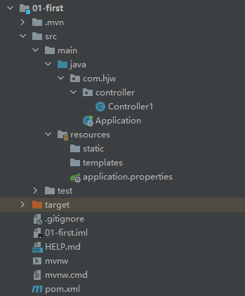

- .mvn|mvnw|mvnw.cmd：使用脚本操作执行 maven 相关命令，国内使用较少，可删除
- .gitignore：使用版本控制工具git 的时候，设置一些忽略提交的内容
- static|templates：后面模板技术中存放文件的目录
- application.properties：SpringBoot 的配置文件，很多集成的配置都可以在该文件中进行配置，例如：Spring、springMVC、Mybatis、Redis 等。目前是空的
- Application.java：SpringBoot 程序执行的入口，执行该程序中的main 方法，SpringBoot就启动了


### pom.xml

**SpringBoot的pom.xml**配置如下：

```xml
<?xml version="1.0" encoding="UTF-8"?>
<project xmlns="http://maven.apache.org/POM/4.0.0" xmlns:xsi="http://www.w3.org/2001/XMLSchema-instance"
         xsi:schemaLocation="http://maven.apache.org/POM/4.0.0 https://maven.apache.org/xsd/maven-4.0.0.xsd">
    <modelVersion>4.0.0</modelVersion>
    <!--继承SpringBoot框架的一个父项目，所有自己开发的 Spring Boot都必须的继承-->
    <parent>
        <groupId>org.springframework.boot</groupId>
        <artifactId>spring-boot-starter-parent</artifactId>
        <version>2.5.4</version>
        <relativePath/> <!-- lookup parent from repository -->
    </parent>
    <!--当前项目的GAV坐标-->
    <groupId>com.hjw</groupId>
    <artifactId>01-first</artifactId>
    <version>0.0.1-SNAPSHOT</version>
    <!--maven项目名称和描述，可以删除-->
    <name>01-first</name>
    <description>Demo project for Spring Boot</description>
    <!--maven属性配置，可以在其它地方通过${}方式进行引用-->
    <properties>
        <java.version>1.8</java.version>
    </properties>

    <dependencies>
        <!--SpringBoot框架web项目起步依赖，通过该依赖自动关联其它依赖，不需要我们一个一个去添加了-->
        <dependency>
            <groupId>org.springframework.boot</groupId>
            <artifactId>spring-boot-starter-web</artifactId>
        </dependency>
        <!--SpringBoot框架测试起步依赖-->
        <dependency>
            <groupId>org.springframework.boot</groupId>
            <artifactId>spring-boot-starter-test</artifactId>
            <scope>test</scope>
        </dependency>
    </dependencies>

    <build>
        <!--SpringBoot提供的打包编译等插件-->
        <plugins>
            <plugin>
                <groupId>org.springframework.boot</groupId>
                <artifactId>spring-boot-maven-plugin</artifactId>
            </plugin>
        </plugins>
    </build>

</project>
```

- Spring Boot 的父级依赖 **spring-boot-starter-parent** 配置之后，当前的项目就是 Spring Boot 项目
- spring-boot-starter-parent 是一个 Springboot 的父级依赖，开发 SpringBoot 程序都需要继承该父级项目，它用来提供相关的Maven 默认依赖，使用它之后，常用的jar包依赖可以省去 version 配置
- Spring Boot 提供了哪些默认 jar 包的依赖，可查看该父级依赖的 pom 文件
- 如果不想使用某个默认的依赖版本，可以通过 pom.xml 文件的属性配置覆盖各个依赖项，比如覆盖 Spring 版本

```xml
<properties>
<spring-framework.version>5.0.0.RELEASE</ spring-framework.version > 
</properties> 
```


**SpringBoot的核心配置文件：（application.properties）**

```properties
#设置内嵌Tomcat端口号
server.port=8081
#设置上下文根
server.servlet.context-path=/01-first
#http://localhost:8080/say ---> http://localhost:8081/01-first/say
```

### **SpringBoot的核心配置文件:(application.yaml)**

作用与application.properties相同。

YAML 是 "YAML Ain't Markup Language"（YAML 不是一种标记语言）的递归缩写。在开发的这种语言时，YAML 的意思其实是："Yet Another Markup Language"（仍是一种标记语言）。yaml 是一种直观的能够被计算机识别的的数据序列化格式，容易被人类阅读，yaml 类似于 xml，但是语法比 xml 简洁很多，值与前面的冒号配置项必须要有一个空格， yml 后缀也可以使用 yaml 后缀。**非常适合用来做以数据为中心的配置文件**。

**基本语法：**

- key: value；kv之间有空格
- 大小写敏感

- 使用缩进表示层级关系
- 缩进不允许使用tab，只允许空格

- 缩进的空格数不重要，只要相同层级的元素左对齐即可
- '#'表示注释

- 字符串无需加引号，如果要加，''与""表示字符串内容 会被 转义/不转义

```yaml
server:
  port: 8081
  servlet:
    context-path: /01-first
#作用同application.properties
```

注意：当两种格式配置文件同时存在，使用的是.properties 配置文件。


**SpringBoot启动入口类**：（项目创建时自动创建，位于src/main/java目录下）

```java
//SpringBoot项目启动入口类
@SpringBootApplication//springBoot核心注解，主要用于开启spring自动配置
public class Application {
    //springBoot项目代码必须放到Application类所在的同级目录或下级目录
    public static void main(String[] args) {
        SpringApplication.run(Application.class, args);
    }
}
```

- **@SpringBootApplication** 注解是 Spring Boot 项目的核心注解，主要作用是开启Spring 自动配置，如果在 Application 类上去掉该注解，那么不会启动 SpringBoot程序，springBoot项目代码必须放到Application类所在的同级目录或下级目录。
- main 方法是一个标准的 Java 程序的 main 方法，主要作用是作为项目启动运行的入口。
- @Controller 及 @ResponseBody 依然是我们之前的 Spring MVC，因为 Spring Boot的里面依然是使用我们的 Spring MVC + Spring + MyBatis 等框架。

### 1.1.1.多环境配置

在实际开发的过程中，我们的项目会经历很多的阶段（开发->测试->上线），每个阶段的配置也会不同，例如：端口、上下文根、数据库等，那么这个时候为了方便在不同的环境之间切换，SpringBoot 提供了多环境配置。具体步骤如下 

为每个环境创建一个配置文件，命名必须以 application-环境标识.properties(或yml)

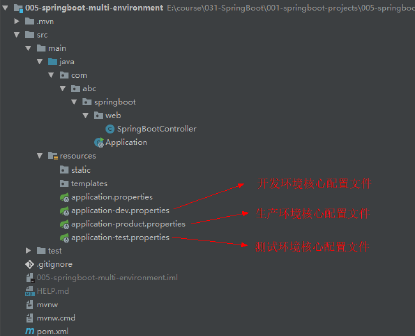

application-dev.properties

```properties
#开发环境
#设置内嵌Tomcat默认端口号
server.port=8080
#设置项目的上下文根
server.servlet.context-path=/005-springboot-multi-environment-dev
```

application-product.properties

```properties
#生产环境
#设置内嵌Tomcat默认端口号
server.port=80
#设置项目的上下文根
server.servlet.context-path=/005-springboot-multi-environment-product
```

application-test.properties

```properties
#测试环境
#设置内嵌Tomcat默认端口号
server.port=8081
#设置项目的上下文根
server.servlet.context-path=/005-springboot-multi-environment-test
```

在总配置文件 application.properties 进行环境的激活

```properties
#SpringBoot的总配置文件
#激活开发环境
#spring.profiles.active=dev
#激活测试环境
#spring.profiles.active=test
#激活生产环境
spring.profiles.active=product
```

**等号右边的值和配置文件的环境标识名一致**，可以更改总配置文件的配置，重新运行Application，查看启动的端口及上下文根。

### 1.1.2.自定义配置

在SpringBoot 的核心配置文件中，除了使用内置的配置项之外，我们还可以在自定义配置，然后采用**@Value注解**去读取配置的属性值 

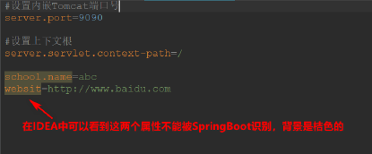

使用@Value注解读取配置值

```java
@Controller
public class Controller1 {

    @Value("${school.name}")
    private String schoolName;

    @RequestMapping("/say")
    @ResponseBody
    public String say(){
        return schoolName;
    }
}
```

使用@ConfigurationProperties:将整个文件映射成一个对象，**用于自定义配置项比较多的情况**(仅能用于属性有前缀名的情况下，即school.name=a可用，而name=a不可用)

```properties
school.name=abc
school.website=123
home.name=def
home.website=456
```

```java
@Component
@ConfigurationProperties(prefix = "school")
public class School {
    private String name;
    private String websit;
    
    public String getName() { return name; }
    public void setName(String name) { this.name = name; }
    public String getWebsite() { return website; }
    public void setWebsite(String website) { this.website = website; }
    
@Component
@ConfigurationProperties(prefix = "home")
public class Home {
    private String name;
    private String websit;
    
    public String getName() { return name; }
    public void setName(String name) { this.name = name; }
    public String getWebsite() { return website; }
    public void setWebsite(String website) { this.website = website; }
```

```java
@Controller
public class Controller1 {
    //***********测试@ConfigurationProperties用于自定义配置项比较多的情况**************
    @Autowired
    private School school;
    @Autowired
    private Home home;

    @RequestMapping("/saySchool")
    @ResponseBody
    public String saySchool(){
        return "school.name=" + school.getName() + "-------->school.website=" + school.getWebsite()
            + "home.name=" + home.getName() + "-------->home.website=" + home.getWebsite();
    }
}
```

### 1.1.3.SpringBoot前端使用jsp

在pom.xml中配置依赖项

```xml
<!--引入SpringBoot内嵌Tomcat对jsp的解析依赖，不添加解析不了jsp-->
<!--仅仅只是展示jsp页面，只添加以下一个依赖-->
<dependency>
    <groupId>org.apache.tomcat.embed</groupId>
    <artifactId>tomcat-embed-jasper</artifactId>
</dependency>
<!--如果要使用servlet必须添加该以下两个依赖-->
<dependency>
    <groupId>javax.servlet</groupId>
    <artifactId>javax.servlet-api</artifactId>
</dependency>
<dependency>
    <groupId>javax.servlet.jsp</groupId>
    <artifactId>javax.servlet.jsp-api</artifactId>
</dependency>

<build>
        <!--
        SpringBoot项目默认推荐使用的前端引擎是thymeleaf
        要使用springBoot继承jsp，需要手动指定jsp最后编译的路径，该路径已由springBoot规定好位置：META-INF/resources-->
        <!--SpringBoot提供的打包编译等插件-->
        <resources>
            <resource>
                <!--源文件夹-->
                <directory>src/main/webapp</directory>
                <!--指定编译到META-INF/resources-->
                <targetPath>META-INF/resources</targetPath>
                <!--指定源文件夹中的哪个资源要编译进行-->
                <includes>
                    <include>*.*</include>
                </includes>
            </resource>
        </resources>
</build>
```

在 application.properties 文件配置 Spring MVC 的视图解析器，展示为jsp，这里相当于 Spring MVC 的配置 

```properties
#配置视图解析器
spring.mvc.view.prefix=/
spring.mvc.view.suffix=.jsp
```

测试：

```java
@Controller
public class Controller1 {
//****************测试SpringBoot前端使用jsp*****************************
    @RequestMapping("sayJSP")
    public ModelAndView sayJSP(){
        ModelAndView mv = new ModelAndView();
        mv.addObject("msg","hello jsp");
        mv.setViewName("sayJSP");
        return mv;
    }
}
```

sayJSP.jsp

```jsp
<body>
<h1>${msg}</h1>
</body>
```

# 二、web开发

## 2.1.集成MyBatis

### 2.1.1.实现步骤：

1、添加依赖

```xml
<!--        mysql驱动-->
        <dependency>
            <groupId>mysql</groupId>
            <artifactId>mysql-connector-java</artifactId>
        </dependency>
<!--        mybatis整合springboot框架的起步依赖-->
        <dependency>
            <groupId>org.mybatis.spring.boot</groupId>
            <artifactId>mybatis-spring-boot-starter</artifactId>
            <version>2.2.0</version>
        </dependency>
```

2、在 Springboot 的核心配置文件 application.properties 中配置数据源

```properties
#配置数据库的连接信息
#注意这里的驱动类有变化
spring.datasource.driver-class-name=com.mysql.cj.jdbc.Driver
spring.datasource.url=jdbc:mysql://localhost:3306/test?useUnicode=true&characterEncoding=UTF-8&useJDBCCompliantTimezoneShift=true&useLegacyDatetimeCode=false&serverTimezone=UTC
spring.datasource.username=root
spring.datasource.password=990307
```

#### **3、springBoot工程下使用MyBatis反向工程**

a）首先拷贝Mybatis反向工程配置文件到项目的根目录下

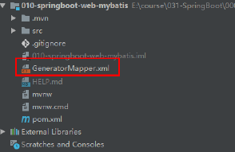

```xml
<?xml version="1.0" encoding="UTF-8"?>
<!DOCTYPE generatorConfiguration
        PUBLIC "-//mybatis.org//DTD MyBatis Generator Configuration 1.0//EN"
        "http://mybatis.org/dtd/mybatis-generator-config_1_0.dtd">
<generatorConfiguration>
    <!-- 指定连接数据库的 JDBC 驱动包所在位置，指定到你本机的完整路径 -->
    <classPathEntry location="D:\java\jdbc\5-code\jdbc_1\lib\mysql-connector-java-5.1.37-bin.jar"/>
    <!-- 配置 table 表信息内容体，targetRuntime 指定采用 MyBatis3 的版本 -->
    <context id="tables" targetRuntime="MyBatis3">
        <!-- 抑制生成注释，由于生成的注释都是英文的，可以不让它生成 -->
        <commentGenerator>
            <property name="suppressAllComments" value="true"/>
        </commentGenerator>
        <!-- 配置数据库连接信息 -->
        <jdbcConnection driverClass="com.mysql.jdbc.Driver"
                        connectionURL="jdbc:mysql://localhost:3306/test"
                        userId="root"
                        password="990307">
        </jdbcConnection>
        <!-- 生成 model 类，targetPackage 指定 model 类的包名， targetProject 指定
        生成的 model 放在 eclipse 的哪个工程下面-->
        <javaModelGenerator targetPackage="com.hjw.model"
                            targetProject="src/main/java">
            <property name="enableSubPackages" value="false"/>
            <property name="trimStrings" value="false"/>
        </javaModelGenerator>
        <!-- 生成 MyBatis 的 Mapper.xml 文件，targetPackage 指定 mapper.xml 文件的
        包名， targetProject 指定生成的 mapper.xml 放在 eclipse 的哪个工程下面 -->
        <sqlMapGenerator targetPackage="com.hjw.mapper"
                         targetProject="src/main/java">
            <property name="enableSubPackages" value="false"/>
        </sqlMapGenerator>
        <!-- 生成 MyBatis 的 Mapper 接口类文件,targetPackage 指定 Mapper 接口类的包
        名， targetProject 指定生成的 Mapper 接口放在 eclipse 的哪个工程下面 -->
        <javaClientGenerator type="XMLMAPPER"
                             targetPackage="com.hjw.mapper" targetProject="src/main/java">
            <property name="enableSubPackages" value="false"/>
        </javaClientGenerator>

        <!-- 数据库表名及对应的 Java 模型类名 -->
        <table tableName="t_student" domainObjectName="Student"
               enableCountByExample="false"
               enableUpdateByExample="false"
               enableDeleteByExample="false"
               enableSelectByExample="false"
               selectByExampleQueryId="false"/>
    </context>
</generatorConfiguration>
```

b）在pom.xml文件中添加mysql反向工程依赖

```xml
<build>
        <plugins>
            <!--mybatis 代码自动生成插件-->
            <plugin>
                <groupId>org.mybatis.generator</groupId>
                <artifactId>mybatis-generator-maven-plugin</artifactId>
                <version>1.3.6</version>
                <configuration>
                    <!--配置文件的位置-->
                    <configurationFile>GeneratorMapper.xml</configurationFile>
                    <verbose>true</verbose>
                    <overwrite>true</overwrite>
                </configuration>
            </plugin>
    </plugins>
</build>
```

c）双击maven中的mybatis-generator:generate插件

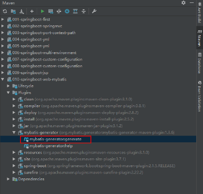

d）最后项目路径下即可自动生成model类、Mapper接口、Mapper.xml等文件（依据sql数据表中的数据创建）

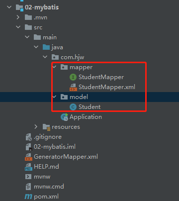

注意：默认情况下，Mybatis 的xml 映射文件不会编译到 target 的 class 目录下，所以我们需要在 pom.xml 文件中配置 resource

```xml
<build>
    <!--手动指定文件夹为resources-->
    <resources>
        <resource>
            <directory>src/main/java</directory>
            <includes>
                <include>**/*.xml</include>

            </includes>
        </resource>
    </resources>
</build>
```

**将接口和映射文件分开：**

因为 SpringBoot 不能自动编译接口映射的 xml 文件，还需要手动在 pom 文件中指定，所以有的公司直接将映射文件直接放到resources 目录下。在 resources 目录下新建目录 mapper 存放映射文件，将 StudentMapper.xml 文件移到 resources/mapper 目录下。(resources文件即类路径classpath)

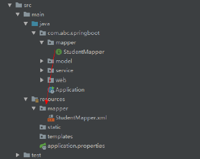

然后在application.properties 配置文件中指定映射文件的位置，这个配置只有接口和映射文件不在同一个包的情况下，才需要指定

```properties
#指定Mybatis映射文件的路径
mybatis.mapper-locations=classpath:mapper/*.xml
```

4、编写实现代码

```java
//service包下
@Service
public class StudentServiceImpl implements StudentService {
    @Autowired
    private StudentMapper studentMapper;
    @Override
    public Student queryStudentById(Integer id) {

        return studentMapper.selectByPrimaryKey(id);
    }
}
//controller包下
@Controller
public class StudentController {
    @Autowired
    private StudentService studentService;

    @RequestMapping("/student")
    @ResponseBody
    public Object student(Integer id){
        Student student = studentService.queryStudentById(id);
        return student;
    }
}
//在启动类上添加mapper组件扫描注解，这样就不用在每一个mapper接口上一个一个写@Mapper
@SpringBootApplication
@MapperScan("com.hjw.mapper")//开启扫描Mapper接口的包
public class Application {
    public static void main(String[] args) {
        SpringApplication.run(Application.class, args);
    }
}
```

### 2.1.2.事务

Spring Boot 使用事务非常简单，底层依然采用的是 Spring 本身提供的事务管理。

- 在入口类中使用注解 @EnableTransactionManagement 开启事务支持。（可不加）
- 只需要在访问数据库的 Service 方法上添加注解 @Transactional 即可

@EnableTransactionManagement 可选（**可加可不加**），但是业务方法上**必须添加@Transactional 事务才生效** 

```java
@Service
public class StudentServiceImpl implements StudentService {
    @Autowired
    private StudentMapper studentMapper;

    @Transactional
    @Override
    public int updateStudentById(Student student) {
        int i = studentMapper.updateByPrimaryKeySelective(student);
        
        int j = i / 0;
        return i;
    }
}
```

## 2.2.SpringBoot下的springMVC注解

### @RestController

Spring 4 后新增注解，是@Controller 注解功能的增强，是 **@Controller 与@ResponseBody 的组合注解**，如果一个 Controller 类添加了@RestController，那么该Controller 类下的所有方法都相当于添加了**@ResponseBody 注解（用于返回字符串或json 数据）**。

```java
//@Controller
@RestController//相当于控制层类上加@Controller + 方法上加@ResponseBody
public class StudentController {
    @RequestMapping("/student")
    //@ResponseBody
    public Object student(){
        Student student = new Student();
        student.setId(1001);
        student.setName("hjw");
        return student;
    }
}
```

### Mapping

- @RequestMapping（常用）

  支持Get 请求，也支持Post 请求

  ```java
  @RequestMapping(value = "/student",method = {RequestMethod.GET,RequestMethod.POST})
  ```

- @GetMapping

  RequestMapping 和 Get 请求方法的组合 只支持 Get 请求 
  **Get 请求主要用于查询操作** 

  相当于

  ```java
  @RequestMapping(value = "/student",method = RequestMethod.GET)
  ```

- @PostMapping

  RequestMapping 和 Post 请求方法的组合 只支持 Post 请求 
  **Post 请求主要用户新增数据** 

  相当于

  ```java
  @RequestMapping(value = "/student",method = RequestMethod.POST)
  ```

- @PutMapping

  RequestMapping 和 Put 请求方法的组合 只支持 Put 请求 
  **Put 通常用于修改数据** 

  相当于

  ```JAVA
  @RequestMapping(value = "/student",method = RequestMethod.PUT)
  ```

- @DeleteMapping

  RequestMapping 和 Delete 请求方法的组合 只支持 Delete 请求 
  **DELETE通常用于删除数据** 

  相当于

  ```java
  @RequestMapping(value = "/student",method = RequestMethod.DELETE)
  ```

## 2.3.SpringBoot实现RESTful

SpringBoot 开发RESTFul 主要是几个注解实现

RESTFul优点：

- 传递参数变简单了
- 服务提供者对外只提供了一个接口服务，而不是传统的 CRUD四个接口

SpringBoot开发RESTFul主要是几个注解实现：

**@PathVariable**：获取url中的数据（**该注解是实现RESTFul最主要的一个注解**）

@PostMapping：接收和处理Post 方式的请求

@DeleteMapping：接收delete 方式的请求，可以使用 GetMapping 代替

@PutMapping：接收put 方式的请求，可以用PostMapping 代替

@GetMapping：接收get 方式的请求

```java
//请求地址：http://localhost:8080/student/wangpeng/23
@RestController
public class RESTFulController {

    @PostMapping("student/{name}/{age}")
    public Object addStudent(@PathVariable("name") String studentName,
                             @PathVariable("age") Integer age){
        Map<String,Object> map = new HashMap<>();
        map.put("name",studentName);
        map.put("age",age);
        return map;
    }
}
```

RESTful 原则:

- 增 post 请求、删 delete 请求、改 put 请求、查 get 请求
- 请求路径不要出现动词，如：/boot/order/1021/1（推荐） ；/boot/queryOrder/1021/1（不推荐）
- 分页、排序等操作，不需要使用斜杠传参数，如：/boot/orders?page=1&sort=desc ，一般传的参数不是数据库表的字段，可以不采用斜杠

其他的普通参数与基本注解除了常用的@PathVariable外还有：@RequestHeader、@ModelAttribute、@RequestParam、@MatrixVariable、@CookieValue、@RequestBody等

```java
@RestController
public class ParameterTestController {

    //  car/2/owner/zhangsan
    @GetMapping("/car/{id}/owner/{username}")
    public Map<String,Object> getCar(@PathVariable("id") Integer id,
                                     @PathVariable("username") String name,
                                     @PathVariable Map<String,String> pv,
                                     @RequestHeader("User-Agent") String userAgent,
                                     @RequestHeader Map<String,String> header,
                                     @RequestParam("age") Integer age,
                                     @RequestParam("inters") List<String> inters,
                                     @RequestParam Map<String,String> params,
                                     @CookieValue("_ga") String _ga,
                                     @CookieValue("_ga") Cookie cookie){


        Map<String,Object> map = new HashMap<>();
//        map.put("id",id);
//        map.put("name",name);
//        map.put("pv",pv);
//        map.put("userAgent",userAgent);
//        map.put("headers",header);
        map.put("age",age);
        map.put("inters",inters);
        map.put("params",params);
        map.put("_ga",_ga);
        System.out.println(cookie.getName()+"===>"+cookie.getValue());
        return map;
    }


    @PostMapping("/save")
    public Map postMethod(@RequestBody String content){
        Map<String,Object> map = new HashMap<>();
        map.put("content",content);
        return map;
    }


    //1、语法： 请求路径：/cars/sell;low=34;brand=byd,audi,yd
    //2、SpringBoot默认是禁用了矩阵变量的功能
    //      手动开启：原理。对于路径的处理。UrlPathHelper进行解析。
    //              removeSemicolonContent（移除分号内容）支持矩阵变量的
    //3、矩阵变量必须有url路径变量才能被解析
    @GetMapping("/cars/{path}")
    public Map carsSell(@MatrixVariable("low") Integer low,
                        @MatrixVariable("brand") List<String> brand,
                        @PathVariable("path") String path){
        Map<String,Object> map = new HashMap<>();

        map.put("low",low);
        map.put("brand",brand);
        map.put("path",path);
        return map;
    }

    // /boss/1;age=20/2;age=10
    @GetMapping("/boss/{bossId}/{empId}")
    public Map boss(@MatrixVariable(value = "age",pathVar = "bossId") Integer bossAge,
                    @MatrixVariable(value = "age",pathVar = "empId") Integer empAge){
        Map<String,Object> map = new HashMap<>();

        map.put("bossAge",bossAge);
        map.put("empAge",empAge);
        return map;

    }

}
```

## 2.4.SpringBoot集成Redis

REmote DIctionary Server(Redis) 是一个由 Salvatore Sanfilippo 写的 key-value 存储系统，是跨平台的非关系型数据库。

Redis 是一个开源的使用 ANSI C 语言编写、遵守 BSD 协议、支持网络、可基于内存、分布式、可选持久性的键值对(Key-Value)存储数据库，并提供多种语言的 API。Redis 通常被称为数据结构服务器，因为值（value）可以是字符串(String)、哈希(Hash)、列表(list)、集合(sets)和有序集合(sorted sets)等类型。

**实现步骤：**（完善根据学生 id 查询学生的功能，先从 redis 缓存中查找，如果找不到，再从数据库中查找，然后放到 redis 缓存中 ）

1. 首先通过myBatis逆向工程生成实体Bean和数据持久层（Mapper）

   

2. 在 pom.xml 文件中添加 redis 依赖 

   ```xml
   <!-- 加载 spring boot redis包 -->
   <dependency>
       <groupId>org.springframework.boot</groupId>
       <artifactId>spring-boot-starter-data-redis</artifactId>
   </dependency>
   ```

3. 核心配置文件中配置redis连接信息（application.properties或application.yaml）

   ```properties
   #配置redis连接信息
   spring.redis.host=localhost
   spring.redis.port=6379
   spring.redis.password=990307
   ```

4. 启动 redis 服务

   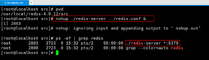

5. 编写代码

   ```java
   //controller类
   @RestController
   public class RedisController {
       @Autowired
       private StudentService studentService;
       @GetMapping(value = "/springboot/allStudentCount")
       public Object allStudentCount(HttpServletRequest request) {
           Long allStudentCount = studentService.queryAllStudentCount();
           return "学生总人数：" + allStudentCount;
       }
   }
   ```

   在 StudentServiceImpl 中注入 RedisTemplate 并修改根据 id获取学生的方法 。注意：Spring Boot 帮我们注入RedisTemplate 类，泛型里面只能写 <String, String>、 <Object, Object>或者什么都不写。

   ```java
   @Service
   public class StudentServiceImpl implements StudentService {
       @Autowired
       private StudentMapper studentMapper;
       @Autowired
       private RedisTemplate<Object,Object> redisTemplate;
       
       @Override
       public Long queryAllStudentCount() {
           //设置redisTemplate对象key的序列化方式
           redisTemplate.setKeySerializer(new StringRedisSerializer());
           //从redis缓存中获取总人数
           Long allStudentCount = (Long)redisTemplate.opsForValue().get("allStudentCount");
           if (null == allStudentCount) {//判断是否为空
               //去数据库查询，并存放到redis缓存中,设置缓存存储时间15秒
               allStudentCount = studentMapper.selectAllStudentCount();
               
               redisTemplate.opsForValue().set("allStudentCount",allStudentCount,15,TimeUnit.SECONDS);
           }
           return allStudentCount;
       }
   }
   ```

   StudentMapper映射文件：

   ```xml
   <!--获取学生总人数-->
   <select id="selectAllStudentCount" resultType="java.lang.Long">
       selsect
       	count(*)
       from
       	t_student
   </select>
   ```

6. 启动 SpringBoot 应用，访问测试 ，并打开 Redis Desktop Mananger 查看 Redis 中的情况 

   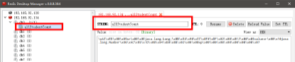

   

## 2.5.SpringBoot集成Dubbo

**集成步骤：**

1. 开发Dubbo服务接口

   a）创建普通 Maven 项目，dubbo 服务接口工程 

   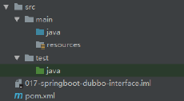

   b）创建 UserService 接口

2. 开发Dubbo服务提供者和Dubbo服务消费者

   1. 创建 SpringBoot 框架的 WEB 项目，添加依赖

      ```xml
      <!--Dubbo集成SpringBoot框架起步依赖-->
      <dependency>
          <groupId>com.alibaba.spring.boot</groupId>
          <artifactId>dubbo-spring-boot-starter</artifactId>
          <version>2.0.0</version>
      </dependency>
      <!--Zookeeper客户端依赖(由于使用zookeeper作为注册中心，需加入zookeeper的客户端依赖)-->
      <dependency>
          <groupId>com.101tec</groupId>
          <artifactId>zkclient</artifactId>
          <version>0.10</version>
      </dependency>
      
      <!--mysql驱动-->
      <dependency>
          <groupId>mysql</groupId>
          <artifactId>mysql-connector-java</artifactId>
      </dependency>
      <!--mybatis整合springboot框架的起步依赖-->
      <dependency>
          <groupId>org.mybatis.spring.boot</groupId>
          <artifactId>mybatis-spring-boot-starter</artifactId>
          <version>2.2.0</version>
      </dependency>
      
      <!--Dubbo接口工程-->
      <dependency>
          <groupId>com.abc.springboot</groupId>
          <artifactId>017-springboot-dubbo-interface</artifactId>
          <version>1.0.0</version>
      </dependency>
      ```

   2. 在核心配置文件中配置Dubbo(application.properties或application.yaml)

      注意：Dubbo 的注解都是自定义的注解，由我们添加的 Dubbo 依赖中的类进行处理编写dubbo 配置是没有提示的。

      ```properties
      #配置dubbo的服务提供者信息
      #服务提供者应用名称(必须写，且不能重复)
      spring.application.name=springboot-dubbo-provider
      #设置当前工程为服务提供者
      spring.dubbo.server=true
      #设置注册中心
      spring.dubbo.registry=zookeeper://localhost:2181
      ```

   3. 编写代码

      a）开发Dubbo服务提供者（编写Dubbo 的接口实现类 ）

      ```java
      @Component
      @Service(interfaceClass = StudentService.class,version = "1.0.0",timeout = 15000)
      //dubbo:service interface="" version="" timeout=""
      public class StudentServiceImpl implements StudentService {
      
          @Override
          public Integer queryAllStudentCount() {
      
              //调用数据持久层
      
              return 1250;
          }
      }
      ```

      b）开发Dubbo服务消费者（编写一个controller类，调用远程的Dubbo服务）

      ```java
      @Controller
      public class StudentController {
          //dubbo:reference interface="" version="" check=false
          //或者@Reference(interfaceName = "com.hjw.service.StudentService",version = "1.0.0",check = false）
          @Reference(interfaceClass = StudentService.class,version = "1.0.0",check = false)
          private StudentService studentService;
      
          @RequestMapping(value = "/student/count")
          public @ResponseBody Object studentCount() {
      
              Integer allStudentCount = studentService.queryAllStudentCount();
      
              return "学生总人数为:"+allStudentCount;
          }
      }
      ```

   4. 在 SpringBoot 入口程序类上加开启 Dubbo 配置支持注解 

      ```java\
      @SpringBootApplication  //开启spring注解配置
      @EnableDubboConfiguration   //开启dubbo配置
      public class Application {
          public static void main(String[] args) {
              SpringApplication.run(Application.class, args);
          }
      }
      ```

   5. 启动 Zookeeper 服务

      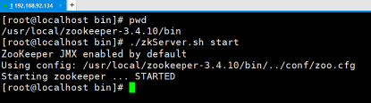

## 2.6.SpringBoot集成SSM+Dubbo+Redis

springBoot集成Dubbo、Redis、SSM、JSP:

1. 接口工程：存放实体bean和业务接口
2. 服务提供者：它是一个springBoot框架web项目，集成MyBatis、Redis
   - 添加依赖：MyBatis依赖、MySQL驱动依赖、Dubbo依赖、zookeeper依赖、Redis依赖、接口工程
   - 配置核心配置文件
     - 配置连接数据库
     - 配置连接Redis
     - 配置Dubbo
3. 服务消费者：它是一个springBoot框架web项目，集成JSP、Dubbo
   - 添加依赖：Dubbo依赖、zookeeper依赖、解析JSP页面的依赖、接口工程
   - 配置核心配置文件
     - 配置视图解析器
     - 配置Dubbo

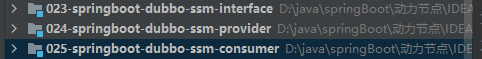

### **实现步骤：**

#### 1.创建 Maven Java 工程，Dubbo 接口工程

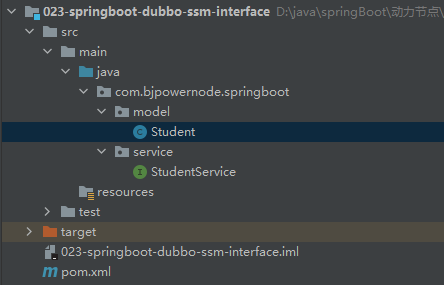

（实体 bean 必须实现序列化）

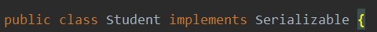

#### 2.创建Dubbo服务提供者项目

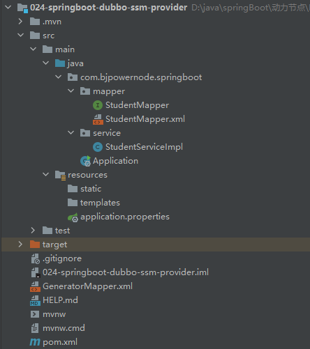

a）添加依赖

```xml
    <dependencies>
        <!--SpringBoot框架web项目起步依赖-->
        <dependency>
            <groupId>org.springframework.boot</groupId>
            <artifactId>spring-boot-starter-web</artifactId>
        </dependency>
        <!--Dubbo集成SpringBoot起步依赖-->
        <dependency>
            <groupId>com.alibaba.spring.boot</groupId>
            <artifactId>dubbo-spring-boot-starter</artifactId>
            <version>2.0.0</version>
        </dependency>
        <!--注册中心-->
        <dependency>
            <groupId>com.101tec</groupId>
            <artifactId>zkclient</artifactId>
            <version>0.10</version>
        </dependency>
        <!--MyBatis集成Springboot起步依赖-->
        <dependency>
            <groupId>org.mybatis.spring.boot</groupId>
            <artifactId>mybatis-spring-boot-starter</artifactId>
            <version>2.0.0</version>
        </dependency>
        <!--MySQL驱动-->
        <dependency>
            <groupId>mysql</groupId>
            <artifactId>mysql-connector-java</artifactId>
        </dependency>

        <!--SpringBoot集成Redis起步依赖-->
        <dependency>
            <groupId>org.springframework.boot</groupId>
            <artifactId>spring-boot-starter-data-redis</artifactId>
        </dependency>
      <!--接口工程-->
        <dependency>
            <groupId>com.bjpowernode.springboot</groupId>
            <artifactId>023-springboot-dubbo-ssm-interface</artifactId>
            <version>1.0.0</version>
        </dependency>

    </dependencies>

    <build>
		<!--手动指定资源配置文件路径-->
        <!--目的：将数据持久层映射文件编译到classpath中-->
        <resources>
            <resource>
                <directory>src/main/java</directory>
                <includes>
                    <include>**/*.xml</include>
                </includes>
            </resource>
        </resources>

        <plugins>
            <!--mybatis 代码自动生成插件-->
            <plugin>
                <groupId>org.mybatis.generator</groupId>
                <artifactId>mybatis-generator-maven-plugin</artifactId>
                <version>1.3.6</version>
                <configuration>
                    <!--配置文件的位置-->
                    <configurationFile>GeneratorMapper.xml</configurationFile>
                    <verbose>true</verbose>
                    <overwrite>true</overwrite>
                </configuration>
            </plugin>
            <plugin>
                <groupId>org.springframework.boot</groupId>
                <artifactId>spring-boot-maven-plugin</artifactId>
            </plugin>
        </plugins>
    </build>

</project>
```

b）配置MyBatis逆向工程，自动生成model类、Mapper接口、Mapper.xml等文件

c）配置核心配置文件

```properties
#配置内嵌Tomcat端口号
server.port=8081
#设置上下文根
server.servlet.context-path=/

#设置连接数据库信息
spring.datasource.driver-class-name=com.mysql.cj.jdbc.Driver
spring.datasource.url=jdbc:mysql://192.168.154.128:3306/springboot?useUnicode=true&characterEncoding=UTF-8&useJDBCCompliantTimezoneShift=true&useLegacyDatetimeCode=false&serverTimezone=GMT%2B8
spring.datasource.username=root
spring.datasource.password=123

#设置dubbo配置
spring.application.name=024-springboot-dubbo-ssm-provider
#声明当前工程为服务提供者
spring.dubbo.server=true
#设置注册中心
spring.dubbo.registry=zookeeper://192.168.154.128:2181

#设置redis配置
spring.redis.host=192.168.154.128
spring.redis.port=6379
spring.redis.password=123456
```

d）配置启动类

```java
@SpringBootApplication
@MapperScan(basePackages = "com.bjpowernode.springboot.mapper")
@EnableDubboConfiguration   //开启dubbo配置
public class Application {
    public static void main(String[] args) {
        SpringApplication.run(Application.class, args);
    }
}
```

#### 3.创建Dubbo服务消费者项目

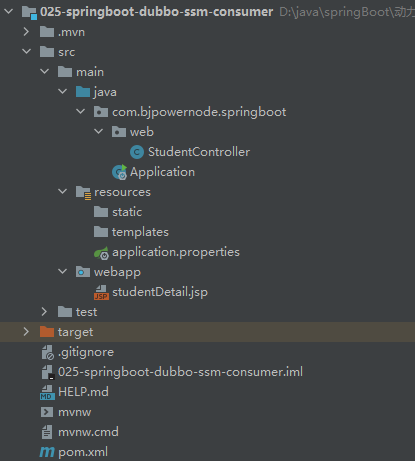

a）添加依赖

```xml
    <dependencies>
        <!--SpringBoot框架web项目起步依赖-->
        <dependency>
            <groupId>org.springframework.boot</groupId>
            <artifactId>spring-boot-starter-web</artifactId>
        </dependency>

        <!--Dubbo集成SpringBoot框架起步依赖-->
        <dependency>
            <groupId>com.alibaba.spring.boot</groupId>
            <artifactId>dubbo-spring-boot-starter</artifactId>
            <version>2.0.0</version>
        </dependency>

        <!--zookeeper注册中心-->
        <dependency>
            <groupId>com.101tec</groupId>
            <artifactId>zkclient</artifactId>
            <version>0.10</version>
        </dependency>

        <!--接口工程-->
        <dependency>
            <groupId>com.bjpowernode.springboot</groupId>
            <artifactId>023-springboot-dubbo-ssm-interface</artifactId>
            <version>1.0.0</version>
        </dependency>

        <!--SpringBoot集成JSP,仅仅只是展示JSP页面需要添加解析jsp页面的依赖-->
        <dependency>
            <groupId>org.apache.tomcat.embed</groupId>
            <artifactId>tomcat-embed-jasper</artifactId>
        </dependency>

    </dependencies>

    <build>

        <resources>
            <resource>
                <directory>src/main/webapp</directory>
                <targetPath>META-INF/resources</targetPath>
                <includes>
                    <include>*.*</include>
                </includes>
            </resource>
        </resources>

        <plugins>
            <!--SpringBoot项目编译打包插件-->
            <plugin>
                <groupId>org.springframework.boot</groupId>
                <artifactId>spring-boot-maven-plugin</artifactId>
            </plugin>
        </plugins>
    </build>

</project>
```

b）配置核心配置文件

```properties
#设置内嵌Tomcat端口号
server.port=8080
server.servlet.context-path=/

#设置dubbo配置
spring.application.name=025-springboot-dubbo-ssm-consumer
spring.dubbo.registry=zookeeper://192.168.154.128:2181

#配置视图解析器
spring.mvc.view.prefix=/
spring.mvc.view.suffix=.jsp
```

c）配置启动类

```java
@SpringBootApplication
@EnableDubboConfiguration   //开启dubbo配置
public class Application {
    public static void main(String[] args) {
        SpringApplication.run(Application.class, args);
    }
}
```

d）编写控制层（StudentController）

```java
@Controller
public class StudentController {

    @Reference(interfaceName = "com.bjpowernode.springboot.service.StudentService",version = "1.0.0",check = false)
    private StudentService studentService;

    @RequestMapping(value = "/student/detail/{id}")
    public String studentDetail(Model model,
                                @PathVariable("id") Integer id) {

        Student student = studentService.queryStudentById(id);

        model.addAttribute("student",student);

        return "studentDetail";
    }
    @GetMapping(value = "/student/all/count")
    public @ResponseBody Object allStudentCount() {

        Integer allStudentCount = studentService.queryAllStudentCount();

        return "学生总人数为:"+allStudentCount;
    }
}
```

#### 4.创建业务接口及实现类

在接口工程中创建业务接口类（StudentService）

```java
public interface StudentService {
    /**
     * 根据学生ID查询详情
     * @param id
     * @return
     */
    Student queryStudentById(Integer id);
    /**
     * 获取学生总人数
     * @return
     */
    Integer queryAllStudentCount();

}
```

在提供者项目中创建业务接口实现类（StudentServiceImpl）

```java
@Component
@Service(interfaceName = "com.bjpowernode.springboot.service.StudentService",version = "1.0.0",timeout = 15000)
public class StudentServiceImpl implements StudentService {
    @Autowired
    private StudentMapper studentMapper;
    @Autowired
    private RedisTemplate<Object,Object> redisTemplate;
    @Override
    public Student queryStudentById(Integer id) {
        return studentMapper.selectByPrimaryKey(id);
    }
    @Override
    public Integer queryAllStudentCount() {
        //提升系统性能,用户体验提升
        //首先去redis缓存中查询,如果有:直接使用,如果没有:去数据库查询并存放到redis缓存中
        Integer allStudentCount = (Integer) redisTemplate.opsForValue().get("allStudentCount");
        //判断是否有值
        if (null == allStudentCount) {
            //去数据库查询
            allStudentCount = studentMapper.selectAllStudentCount();
            //并存放到redis缓存中
            redisTemplate.opsForValue().set("allStudentCount",allStudentCount,30, TimeUnit.SECONDS);
        }
        return allStudentCount;
    }
}
```

#### 5.启动浏览器进行测试

## 2.7.SpringBoot非web应用程序

1. 方式一：直接在 main 方法中，根据 SpringApplication.run()方法获取返回的 Spring 容器对象，再获取业务 bean 进行调用 

   - 首先创建一个springBoot Module，不勾选任何依赖

   - 然后创建一个userServiceImpl进行演示

     ```java
     +@Service
     public class StudentServiceImpl implements StudentService {
         @Override
         public String sayHello() {
             return "Say Hello";
         }
     }
     ```

   - 最后在 Application启动类的 main 方法中，获取容器，调用业务 bean 

     ```java
     @SpringBootApplication
     public class Application {
         public static void main(String[] args) {
             /**
              * Springboot程序启动后,返回值是ConfigurableApplicationContext,它也是一个Spring容器
              * 它其实相当于原来Spring容器中启动容器ClasspathXmlApplicationContext
              */
             SpringApplication.run(Application.class, args);
             //获取Springboot容器
             ConfigurableApplicationContext applicationContext = SpringApplication.run(Application.class, args);
             //从spring容器中获取指定bean对象
             StudentService studentService = (StudentService) applicationContext.getBean("studentServiceImpl");
             //调用业务方法
             String sayHello = studentService.sayHello();
             System.out.println(sayHello);
         }
     }
     ```

2. 方式二：Spring boot 的入口类实现 CommandLineRunner 接口 

   与方式一不同的地方在于启动类代码

   ```java
   @SpringBootApplication  //开启spring配置
   public class Application implements CommandLineRunner {
       @Autowired
       private StudentService studentService;
   
       public static void main(String[] args) {
           //SpringBoot启动程序,会初始化Spring容器
           SpringApplication.run(Application.class, args);
       }
       //重写CommandLineRunner类中的run方法
       @Override
       public void run(String... args) throws Exception {
           //调用业务方法
           String sayHello = studentService.sayHello("World");
           System.out.println(sayHello);
       }
   }
   ```

# 三、SpringBoot使用拦截器

**实现步骤：**

a）定义一个拦截器，实现HandlerInterceptor接口（同样需要在项目类所在的包或者子包下），如下登录拦截器：

```java
public class UserInterceptor implements HandlerInterceptor {
    @Override
    public boolean preHandle(HttpServletRequest request, HttpServletResponse response, Object handler) throws Exception {
        System.out.println("进入拦截器------------------------------");
        //编写业务拦截的规则
        //从session中获取用户的信息
        User user = (User) request.getSession().getAttribute("user");
        //判断用户是否登录
        if (null == user) {
            //未登录
            response.sendRedirect(request.getContextPath() + "/user/error");
            return false;
        }
        return true;
    }
    @Override
    public void postHandle(HttpServletRequest request, HttpServletResponse response, Object handler, ModelAndView modelAndView) throws Exception {
    }
    @Override
    public void afterCompletion(HttpServletRequest request, HttpServletResponse response, Object handler, Exception ex) throws Exception {
    }
}
```

b）创建一个配置类（即原先在SpringMVC配置文件中使用mvc:interceptors标签）

```java
@Configuration  //定义此类为配置文件(即相当于之前的xml配置文件)
public class InterceptorConfig implements WebMvcConfigurer {
    //mvc:interceptors
    @Override
    public void addInterceptors(InterceptorRegistry registry) {
        //要拦截user下的所有访问请求,必须用户登录后才可访问,
        // 但是这样拦截的路径中有一些是不需要用户登录也可访问的
        String[] addPathPatterns = {
            "/user/**"
        };
        //要排除的路径,排除的路径说明不需要用户登录也可访问
        String[] excludePathPatterns = {
            "/user/out", "/user/error","/user/login"
        };
        //mvc:interceptor bean class=""
        registry.addInterceptor(new UserInterceptor()).addPathPatterns(addPathPatterns).excludePathPatterns(excludePathPatterns);
    }
}
```

c）创建controller控制层进行测试

```java
@Controller
@RequestMapping(value = "/user")
public class UserController {
    //用户登录的请求,需要排除
    @RequestMapping(value = "/login")
    public @ResponseBody Object login(HttpServletRequest request) {
        //将用户的信息存放到session中
        User user = new User();
        user.setId(1001);
        user.setUsername("zhangsan");
        request.getSession().setAttribute("user",user);

        return "login SUCCESS";
    }
    //该请求需要用户登录之后才可访问
    @RequestMapping(value = "/center")
    public @ResponseBody Object center() {
        return "See Center Message";
    }
    //该请求不登录也可访问
    @RequestMapping(value = "/out")
    public @ResponseBody Object out() {
        return "Out see anytime";
    }
    //如果用户未登录访问了需要登录才可访问的请求,之后会跳转至该请求路径
    //该请求路径不需要用户登录也可访问
    @RequestMapping(value = "/error")
    public @ResponseBody Object error() {
        return "error";
    }
}
```

# 四、 SpringBoot中使用Servlet和Filter(了解)

## 4.1.使用Servlet

### 4.1.1.通过注解扫描方式实现

a）通过注解方式创建一个servlet

```java
@WebServlet(urlPatterns = "/myservlet")
public class MyServlet extends HttpServlet {

    @Override
    protected void doGet(HttpServletRequest req, HttpServletResponse resp) throws ServletException, IOException {
       resp.getWriter().println("My SpringBoot Servlet-1");
       resp.getWriter().flush();
       resp.getWriter().close();

    }
    @Override
    protected void doPost(HttpServletRequest req, HttpServletResponse resp) throws ServletException, IOException {
        doGet(req, resp);
    }
}
```

b）在主应用程序类上添加@ServletComponentScan

```java
@SpringBootApplication  //开启spring配置
@ServletComponentScan(basePackages = "com.bjpowernode.springboot.servlet")
public class Application {
    public static void main(String[] args) {
        SpringApplication.run(Application.class, args);
    }

}
```

c）启动项目，浏览器访问测试

### 4.1.2.通过SpringBoot配置类实现(组件注册)

a）注册一个普通的Servlet

```java
public class MyServlet extends HttpServlet {
    @Override
    protected void doGet(HttpServletRequest req, HttpServletResponse resp) throws ServletException, IOException {
        resp.getWriter().println("My SpringBoot Servlet-2");
        resp.getWriter().flush();
        resp.getWriter().close();
    }
    @Override
    protected void doPost(HttpServletRequest req, HttpServletResponse resp) throws ServletException, IOException {
        doGet(req, resp);
    }
}
```

b）编写一个SpringBoot配置类，在类中注册Servlet

```java
@Configuration  //该注解将此类定义为配置类(相当一个xml配置文件)
public class ServletConfig {

    //@Bean是一个方法级别上的注解,主要用在配置类里
    //相当于一个
    // <beans>
    //      <bean id="" class="">
    // </beans>
    @Bean
    public ServletRegistrationBean myServletRegistrationBean() {
        ServletRegistrationBean servletRegistrationBean = new ServletRegistrationBean(new MyServlet(),"/myservlet");

        return servletRegistrationBean;
    }
}
```

c）启动项目，浏览器访问测试

## 4.2.使用Filte

### 4.2.1.通过注解方式实现

a）通过注解方式创建一个Filter

```java
@WebFilter(urlPatterns = "/myfilter")
public class MyFilter implements Filter {
    @Override
    public void doFilter(ServletRequest servletRequest, ServletResponse servletResponse, FilterChain filterChain) throws IOException, ServletException {
        System.out.println("-------------------您已进入过滤器---------------------");

        filterChain.doFilter(servletRequest, servletResponse);
    }
}
```

b）在主应用程序类上添加@ServletComponentScan

```java
@SpringBootApplication
@ServletComponentScan(basePackages = "com.bjpowernode.springboot.filter")
public class Application {
    public static void main(String[] args) {
        SpringApplication.run(Application.class, args);
    }
}
```

c）启动项目，浏览器访问测试

### 4.2.2.通过SpringBoot配置类实现(组件注册)

a）注册一个普通的Filter

```java
public class MyFilter implements Filter {
    @Override
    public void doFilter(ServletRequest servletRequest, ServletResponse servletResponse, FilterChain filterChain) throws IOException, ServletException {
        System.out.println("-------------------您已进入过滤器-222-------------------");
        filterChain.doFilter(servletRequest, servletResponse);
    }
}
```

b）编写一个SpringBoot配置类，在类中注册Filter

```java
@Configuration  //定义此类为配置类
public class FilterConfig {

    @Bean
    public FilterRegistrationBean myFilterRegistrationBean() {

        //注册过滤器
        FilterRegistrationBean filterRegistrationBean = new FilterRegistrationBean(new MyFilter());
        //添加过滤路径
        filterRegistrationBean.addUrlPatterns("/user/*");
        return filterRegistrationBean;
    }
}
```

c）启动项目，浏览器访问测试

# 五、SpringBoot项目配置字符编码

## 5.1.方式一：使用传统的Spring提供的字符编码过滤器

a）创建一个Servlet

```java
@WebServlet(urlPatterns = "/myservlet")
public class MyServlet extends HttpServlet {
    @Override
    protected void doGet(HttpServletRequest req, HttpServletResponse resp) throws ServletException, IOException {
        resp.getWriter().println("世界您好,Hello World!");
        //统一设置浏览器编码格式
        resp.setContentType("text/html;character=utf-8");
        resp.getWriter().flush();
        resp.getWriter().close();
    }
    @Override
    protected void doPost(HttpServletRequest req, HttpServletResponse resp) throws ServletException, IOException {
        doGet(req, resp);
    }
}
```

b）创建配置类SystemConfig

```java
@Configuration  //将此类定义为配置文件
public class SystemConfig {
    @Bean
    public FilterRegistrationBean characterEncodingFilterRegistrationBean() {
        //创建字符编码过滤器
        CharacterEncodingFilter characterEncodingFilter = new CharacterEncodingFilter();
        //设置强制使用指定字符编码
        characterEncodingFilter.setForceEncoding(true);
        //设置指定字符编码
        characterEncodingFilter.setEncoding("UTF-8");
        FilterRegistrationBean filterRegistrationBean = new FilterRegistrationBean();
        //设置字符编码过滤器
        filterRegistrationBean.setFilter(characterEncodingFilter);
        //设置字符编码过滤器路径
        filterRegistrationBean.addUrlPatterns("/*");
        return filterRegistrationBean;
    }
}
```

c）关闭SpringBoot的http字符编码支持（配置文件中）

```properties
#关闭springboot的http字符编码支持
#只有关闭该选项后,spring字符编码过滤器过生效
spring.http.encoding.enabled=false
```

## 5.2.方式二：在核心配置文件中配置字符编码（推荐）

（从SpringBoot1.4.2之后开始新增的一种字符编码设置）

```properties
#设置请求响应字符编码
spring.http.encoding.enabled=true
spring.http.encoding.force=true
spring.http.encoding.charset=utf-8
```

# 六、SpringBoot打包与部署

## 6.1.springBoot程序war包部署

### 6.1.1创建SpringBoot Web项目

a）添加SpringBoot解析jsp依赖

```xml
<!--SpringBoot内嵌Tomcat解析jsp的依赖-->
<dependency>
    <groupId>org.apache.tomcat.embed</groupId>
    <artifactId>tomcat-embed-jasper</artifactId>
</dependency>
```

b）配置jsp文件解析目录

```xml
<!--
SpringBoot要求jsp文件必须编译到指定的META-INF/resources目录中，否则不能访问
-->
<resources>
    <resource>
        <!--源文件位置-->
        <directory>src/main/webapp</directory>
        <!--指定编译到META-INF/resources目录下，该目录不能随便编写-->
        <targetPath>META-INF/resources</targetPath>
        <!--指定包含文件-->
        <includes>
            <include>*.*</include>
        </includes>
    </resource>
</resources>
```

c）创建webapp并指定为web资源文件夹

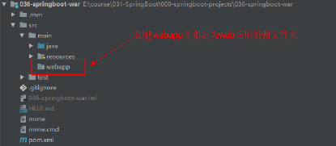

d）核心配置文件中配置jsp前后缀

```properties
spring.mvc.view.prefix=/
spring.mvc.view.suffix=.jsp
```

e）创建IndexController提供方法分别返回字符串及跳转页面

```java
@Controller
public class UserController {
    
    @RequestMapping(value = "/user/detail")
    public @ResponseBody Object userDetail() {

        Map<String,Object> retMap = new HashMap<String, Object>();
        retMap.put("id",1001);
        retMap.put("username","lisi");

        return retMap;
    }

    @RequestMapping(value = "/user/page/detail")
    public String userPageDetail(Model model) {
        model.addAttribute("id",1001);
        model.addAttribute("username","wangwu");
        return "userDetail";
    }
}
```

f）在 src/main/webapp 目录下创建 index.jsp

```jsp
<%@ page contentType="text/html;charset=UTF-8" language="java" %>
<html>
<head>
    <title>Title</title>
</head>
<body>
<h3>用户编码:${id}</h3>
<h3>用户姓名:${username}</h3>
</body>
</html>
```

### 6.1.2.打war包

a）程序入口类继承 SpringBootServletInitializer类并覆盖 configure 方法

```java
@SpringBootApplication
public class Application extends SpringBootServletInitializer {

    public static void main(String[] args) {
        SpringApplication.run(Application.class, args);
    }

    @Override
    protected SpringApplicationBuilder configure(SpringApplicationBuilder builder) {

        //参数为当前springboot启动类
        //构造新资源
        return builder.sources(Application.class);
    }
}
```

b）在 pom.xml 中添加（修改）打包方式为 war。配置springboot 打包的插件(默认自动加)

```xml
<!--修改打包方式-->
<packaging>war</packaging>
<!--SpringBoot打包插件-->
<plugins>
    <plugin>
        <groupId>org.springframework.boot</groupId>
        <artifactId>spring-boot-maven-plugin</artifactId>
    </plugin>
</plugins>
```

c）在 pom.xml 中配置将配置文件编译到类路径

```xml
<resources>
    <resource>
        <!--源文件夹-->
        <directory>src/main/webapp</directory>
        <!--目标文件夹-->
        <targetPath>META-INF/resources</targetPath>
        <!--包含的文件夹-->
        <includes>
            <include>*.*</include>
        </includes>
    </resource>
	<!--mybatis的mapper.xml-->
    <resource>
        <directory>src/main/resources</directory>
        <includes>
            <include>**/*.*</include>
        </includes>
    </resource>
    <!--src/main/resources下的所有配置文件编译到classes下面去-->
    <resource>
        <directory>src/main/resources</directory>
        <includes>
            <include>**/*.*</include>
        </includes>
    </resource>
</resources>
```

d）在 pom.xml 的 build 标签下通过 finalName 指定打 war

```xml
<!--指定打war包的字符-->
<finalName>springboot</finalName>
```

e）通过 Maven package 命令打 war 包到 target 目录下

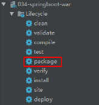

### 6.1.3.部署到Tomcat服务器上测试运行

a）将target 目录下生成的war 包拷贝到tomcat 的webapps目录，并启动 tomcat

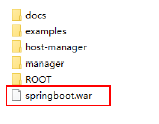

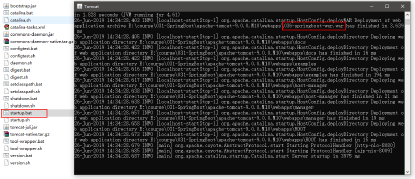

## 6.2.SpringBoot程序打Jar包与运行

因为 SpringBoot 默认打包方式就是jar 包,所以我们直接执行 Maven 的package 命令就行了

a）pom.xml

```xml
<!--SpringBoot项目内嵌tomcat对jsp的解析包-->
<dependency>
    <groupId>org.apache.tomcat.embed</groupId>
    <artifactId>tomcat-embed-jasper</artifactId>
</dependency>

<!--在 pom.xml 文件中添加 resources 配置，以后为了保险起见，大家在打包的时候，建议把下面的配置都加上-->
<resources>
    <resource>
        <!--源文件夹-->
        <directory>src/main/webapp</directory>
        <!--目标文件夹-->
        <targetPath>META-INF/resources</targetPath>
        <!--包含的文件夹-->
        <includes>
            <include>*.*</include>
        </includes>
    </resource>
	<!--mybatis的mapper.xml-->
    <resource>
        <directory>src/main/resources</directory>
        <includes>
            <include>**/*.*</include>
        </includes>
    </resource>
    <!--src/main/resources下的所有配置文件编译到classes下面去-->
    <resource>
        <directory>src/main/resources</directory>
        <includes>
            <include>**/*.*</include>
        </includes>
    </resource>
</resources>

<!--修改 pom.xml 文件中打包插件的版本-->
<!--默认 SpingBoot 提供的打包插件版本为 2.2.2.RELEASE，这个版本打的 jar 包 jsp 不能访问，我们这里修改为 1.4.2.RELEASE（其它版本测试都有问题）-->
<plugins>
    <plugin>
        <groupId>org.springframework.boot</groupId>
        <artifactId>spring-boot-maven-plugin</artifactId>
        <version>1.4.2.RELEASE</version>
    </plugin>
</plugins>
```

b）修改 application.properties 配置文件

```properties
#设置内嵌Tomcat端口号
server.port=9090
#设置项目上下文根
server.servlet.context-path=/
#配置jsp前后缀
spring.mvc.view.prefix=/
spring.mvc.view.suffix=.jsp
```

c）创建控制层controller

```java
@Controller
public class UserController {

    @RequestMapping(value = "/user/json/detail")
    public @ResponseBody Object userJsonDetail() {
        Map<String,Object> retMap = new HashMap<String, Object>();
        retMap.put("id",1001);
        retMap.put("username","wangwu");

        return retMap;
    }

    @RequestMapping(value = "/user/page/detail")
    public String userPageDetail(Model model) {
        model.addAttribute("id",1002);
        model.addAttribute("username","zhaoliu");
        return "userDetail";
    }
}
```

d）创建webapp并指定为web资源目录

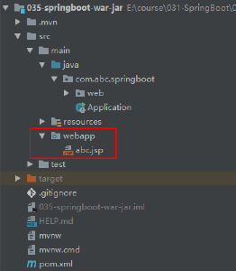

e）通过maven package打jar包到 target 目录下

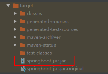

f）通过 java 命令执行 jar 包，相当于启动内嵌 tomcat

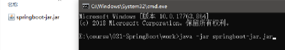

# 七、SpringBoot集成logback日志

**实现步骤：**

a）创建 SpringBoot 框架 web 项目

b）在项目 pom.xml 中添加 SSM 需要的依赖

```xml
<dependencies>
    <!--SpringBoot框架web项目起步依赖-->
    <dependency>
        <groupId>org.springframework.boot</groupId>
        <artifactId>spring-boot-starter-web</artifactId>
    </dependency>
	<!--连接MySQL的驱动-->
    <dependency>
        <groupId>mysql</groupId>
        <artifactId>mysql-connector-java</artifactId>
    </dependency>

    <!--SpringBoot内嵌Tomcat解析jsp的依赖-->
	<dependency>
    	<groupId>org.apache.tomcat.embed</groupId>
    	<artifactId>tomcat-embed-jasper</artifactId>
	</dependency>
    
    <dependency>
        <groupId>org.mybatis.spring.boot</groupId>
        <artifactId>mybatis-spring-boot-starter</artifactId>
        <version>2.0.0</version>
    </dependency>
</dependencies>
```

c）编写集成 SSM 在 application.properties 的配置 

```properties
#配置连接MySQL数据库信息
spring.datasource.driver-class-name=com.mysql.cj.jdbc.Driver
spring.datasource.url=jdbc:mysql://192.168.154.128:3306/springboot?useUnicode=true&characterEncoding=UTF-8&useJDBCCompliantTimezoneShift=true&useLegacyDatetimeCode=false&serverTimezone=GMT%2B8
spring.datasource.username=root
spring.datasource.password=123
```

d）通过MyBatis逆向工程生成DAO，并编写实现代码以及控制层

**e）编写日志文件**

Spring Boot 官方推荐优先使用带有 -spring 的文件名作为你的日志配置（如使用 logback-spring.xml ，而不是 logback.xml），命名为 logback-spring.xml 的日志配置文件。 默认的命名规则，并且放在 src/main/resources 下如果你即想完全掌控日志配置，但又不想用 logback.xml 作为Logback 配置的名字，核心配置文件可以通过 logging.config 属性指定自定义的名字： 

```properties
logging.config=classpath:logging-config.xml
```

（1）我们一般针对 DAO 的包进行 DEBUG 日志设置：

```xml
<logger name="com.abc.springboot.mapper" level="DEBUG" />
```

这样的话，只打印 SQL 语句：

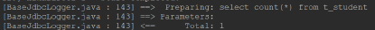

（2）代码里打印日志

之前我们大多数时候自己在每个类创建日志对象去打印信息，比较麻烦： private static final Logger logger = LoggerFactory.getLogger(StudentServiceImpl.class); logger.error("xxx"); 
现在可以直接在类上通过 @Slf4j 标签去声明式注解日志对象 

​	在 pom.xml 中添加依赖

```xml
<!--@slf4j自动化日志对象-->
<dependency>
    <groupId>org.projectlombok</groupId>
    <artifactId>lombok</artifactId>
</dependency>
```

​	添加lombok插件

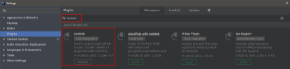

​	编写logback-spring.xml

```xml
<?xml version="1.0" encoding="UTF-8"?>
<!-- 日志级别从低到高分为
TRACE < DEBUG < INFO < WARN < ERROR < FATAL，
如果设置为 WARN，则低于 WARN 的信息都不会输出 -->
<!--
scan:当此属性设置为 true 时，配置文件如果发生改变，将会被重新加载，默认值为true
-->
<!-- scanPeriod:设置监测配置文件是否有修改的时间间隔，如果没有给出时间单位，默认
单位是毫秒。当 scan 为 true 时，此属性生效。默认的时间间隔为 1 分钟。 -->
<!-- debug:当此属性设置为 true 时，将打印出 logback 内部日志信息，实时查看 logback
运行状态。默认值为 false。通常不打印 -->
<configuration scan="true" scanPeriod="10 seconds">
    <!--输出到控制台-->
    <appender name="CONSOLE" class="ch.qos.logback.core.ConsoleAppender">
        <!--此日志 appender 是为开发使用，只配置最底级别，控制台输出的日志级别是大
        于或等于此级别的日志信息-->
        <filter class="ch.qos.logback.classic.filter.ThresholdFilter">
            <level>debug</level>
        </filter>
        <encoder>
            <Pattern>%date [%5p] [%thread] %logger{60} [%file : %line] %msg%n
            </Pattern>
            <!-- 设置字符集 -->
            <charset>UTF-8</charset>
        </encoder>
    </appender>

    <!--单个定义-->
    <logger name="com.bjpowernode.springboot.mapper" level="trace"/>

    <!--如果root标签指定的日志级别那么以根日志级别为准,如果没有则已当前追加器日志级别为准-->
    <!--全部-->
    <!--
        appender trace  trace
        root     trace

        appender trace  debug
        root     debug

        appender trace   debug
        root     空      如果root没有值默认root级别是debug

        appender debug  info
        root     info
    -->
    <root level="info">
        <appender-ref ref="CONSOLE"/>
        <!--<appender-ref ref="FILE"/>-->
    </root>
</configuration>
```

# 八、SpringBoot集成Thymeleaf模板

Thymeleaf 是一个流行的**模板引擎**，该模板引擎采用 Java 语言开发 。

模板引擎是一个技术名词，是跨领域跨平台的概念，在 Java 语言体系下有模板引擎，在 C#、PHP 语言体系下也有模板引擎，甚至在 JavaScript 中也会用到模板引擎技术，Java 生态下的模板引擎有 Thymeleaf 、Freemaker、Velocity、Beetl（国产） 等。 

Thymeleaf 对网络环境不存在严格的要求，既能用于 Web 环境下，也能用于非 Web 环境下。在非Web 环境下，他能直接显示模板上的静态数据；在 Web 环境下，它能像 Jsp 一样从后台接收数据并替换掉模板上的静态数据。它是基于 HTML 的，以 HTML 标签为载体， Thymeleaf 要寄托在 HTML 标签下实现。 

SpringBoot 集成了 Thymeleaf 模板技术，并且 Spring Boot 官方也推荐使用 Thymeleaf 来替代 JSP 技术，Thymeleaf 是另外的一种模板技术，它本身并不属于 Spring Boot，Spring Boot只是很好地集成这种模板技术，作为前端页面的数据展示，在过去的 Java Web 开发中，我们往往会选择使用 Jsp 去完成页面的动态渲染，但是 jsp 需要翻译编译运行，效率低。

## 8.1.实现步骤：

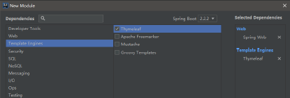

a）按照这种方式创建后，pom.xml 文件下会自动添加如下依赖：

```xml
<!--SpringBoot框架集成Thymeleaf的起步依赖-->
<dependency>
    <groupId>org.springframework.boot</groupId>
    <artifactId>spring-boot-starter-thymeleaf</artifactId>
</dependency>
<!--SpringBoot框架web项目起步依赖-->
<dependency>
    <groupId>org.springframework.boot</groupId>
    <artifactId>spring-boot-starter-web</artifactId>
</dependency>
```

b）在 Spring boot 的核心配置文件 application.properties 中对Thymeleaf 进行配置 

(其实什么都不用配置就可以工作，因为基本 Thymeleaf 的配置都有默认值)

```properties
#设置thymeleaf模版引擎的缓存,设置为false关闭,默认为true开启
#建议在开发阶段关闭thymeleaf页面缓存，目的实时看到页面
spring.thymeleaf.cache=false

#设置thymeleaf模版引擎的前/后缀,(可选项)
spring.thymeleaf.prefix=classpath:/templates/
spring.thymeleaf.suffix=.html
```

c）测试

1. 创建 ThymeleafControlle 去映射到模板页面（和 SpringMVC 基本一致）

   ```java
   @Controller
   public class UserController {
   
       @RequestMapping(value = "/message")
       public String message(Model model) {
   
           model.addAttribute("data","SpringBoot集成Thymeleaf模版引擎");
   
           return "message";
       }
   }
   ```

2. 在 src/main/resources 的 templates 下新建一个 index.html 页面用于展示数据 

   ```html
   <!DOCTYPE html>
   <html lang="en" xmlns:th="http://www.thymeleaf.org">
   <head>
       <meta charset="UTF-8">
       <title>Title</title>
   </head>
   <body>
   <!--
       thymeleaf模版引擎的页面必须得通过中央调度器
   	thymeleaf前端框架以html为载体
   -->
   <h2 th:text="${data}">展示要显示的内容0</h2>
   </body>
   </html>
   ```

**注意：**Springboot 使用 thymeleaf 作为视图展示，约定将模板文件放置在src/main/resource/templates 目录下，静态资源放置在src/main/resource/static 目录下。

## 8.2.Thymeleaf基本语法

### 8.2.1.标准变量表达式

| 表达式名字      | 语法   | 用途                               |
| --------------- | ------ | ---------------------------------- |
| 标准变量        | ${...} | 获取请求域、session域、对象等值    |
| 选择变量        | *{...} | 获取上下文对象值                   |
| 消息            | #{...} | 获取国际化等值                     |
| URL表达式(链接) | @{...} | 生成链接                           |
| 片段表达式      | ~{...} | jsp:include 作用，引入公共页面片段 |

**标准变量表达式**用于访问容器（tomcat）上下文环境中的变量，功能和 EL 中的 ${} 相同。Thymeleaf 中的变量表达式使用 ${变量名} 的方式获取 Controller 中model 其中的数据。

**选择变量表达式**，也叫星号变量表达式，使用 th:object 属性来绑定对象。
选择表达式首先使用th:object 来绑定后台传来的 User 对象，然后使用 * 来代表这个对象，后面 {} 中的值是此对象中的属性。 选择变量表达式在执行时是在选择的对象上求解，而${...}是在上下文的变量Model 上求解，这种写法比标准变量表达式繁琐，只需要大家了解即可。

```html
<body>
<h1>标准变量表达式:${} -> (推荐)</h1>
用户编号:<span th:text="${user.id}"></span><br/>
用户姓名:<span th:text="${user.username}"></span><br/>
用户年龄:<span th:text="${user.age}"></span><br/>

<h1>选择变量表达式(星号表达式):*{} -> (不推荐)</h1>
<!--
    *{}必须使用th:object属性来绑定这个对象
    在div子标签中使用*来代替绑定的对象${user}
-->
<div th:object="${user}">
    用户编号:<span th:text="*{id}"></span><br/>
    用户姓名:<span th:text="*{username}"></span><br/>
    用户年龄:<span th:text="*{age}"></span><br/>
</div>

<h1>标准变量表达式与选择变量表达式的混合使用(不推荐)</h1>
用户编号<span th:text="*{user.id}"></span><br/>
用户年龄<span th:text="*{user.age}"></span><br/>
用户姓名<span th:text="*{user.username}"></span><br/>
</body>
```

**URL 表达式**主要用于链接、地址的展示，可用于<script src="...">、<link href="...">、<a href="...">、<form action="...">、等，可以在 URL 路径中动态获取数据。

```html
<body>
<h1>URL路径表达式:@{....}</h1>
<h2>a标签中的绝对路径(没有参数)</h2>
<a href="http://www.baidu.com">传统写法:跳转至百度</a><br/>
<a th:href="@{http://www.bjpowernode.com}">路径表达式:路径到动力节点</a><br/>
<a th:href="@{http://localhost:8080/user/detail1}">跳转至:/user/detail1</a><br/>
<a href="http://localhost:8080/user/detail1">传统写法跳转至:/user/detail1</a><br/>

<h2>URL路径表达式,相对路径[没有参数](实际开发中推荐使用的)</h2>
<a th:href="@{/user/detail1}">跳转至:/user/detail1</a><br/>

<h2>绝对路径(带参数)(不推荐使用)</h2>
<a href="http://localhost:8080/test?username='zhangsan'">绝对路径,带参数:/test,并带参数username</a><br/>
<a th:href="@{http://localhost:8080/test?username=zhangsan}">路径表达工写法,带参数:/test,并带参数username</a><br/>

<h2>相对路径(带参数)</h2>
<a th:href="@{/test?username=lisi}">相对路径,带参数</a>

<h2>相对路径(带参数:后台获取的参数值)</h2>
<!--/test?username=1001-->
<a th:href="@{'/test?username='+${id}}">相对路径:获取后台参数值</a>

<h2>相对路径(带多个参数:后台获取的参数值)</h2>
<!--
    /test1?id=1001&username=zhaoliu&age=28
-->
<a th:href="@{'/test1?id='+${id}+'&username='+${username}+'&age='+${age}}">相对路径(带多个参数:后台获取的参数值)</a>
<a th:href="@{/test1(id=${id},username=${username},age=${age})}">强烈推荐使用:@{}相对路径(带多个参数:后台获取的参数值)</a><br/>
<a th:href="@{'/test2/'+${id}}">请求路径为RESTful风格</a><br/>
<a th:href="@{'/test3/'+${id}+'/'+${username}}">请求路径为RESTful风格</a><br/>
</body>
```

### 8.2.2.Thymeleaf的常见属性及运算

a）Thymeleaf大部分属性和 html 的一样，只不过前面加了一个 th 前缀。

- th:action 定义后台控制器的路径，类似<form>标签的 action 属性，主要结合 URL 表达式,获取动态变量

- th:method 设置请求方法

- th:href 定义超链接，主要结合 URL 表达式,获取动态变量

- th:src 用于外部资源引入，比如<script>标签的 src 属性，标签的 src 属性，常与@{}表达式结合使用，在SpringBoot 项目的静态资源都放到resources 的 static 目录下。 放到 static 路径下的内容，写路径时不需要写上static 

  ```html
  <h1>th:src属性的使用</h1>
  <!--以下方式无法引入js-->
  <script src="/static/js/jquery-1.7.2.min.js"></script>
  <!--该方法是常用方法-->
  <script type="text/javascript" th:src="@{/jquery-1.7.2.min.js}"></script>
  ```

- th:id 类似 html 标签中的 id 属性 

- th:name 设置名称 

  ```html
  <input th:type="text" th:id="userName" th:name="userName"> 
  ```

- th:value 类似 html 标签中的 value 属性，能对某元素的 value 属性进行赋值 

- th:attr 该属性也是用于给 HTML 中某元素的某属性赋值，好处是可以给 html 中没有定义的属性动态的赋值。 

- th:text 用于文本的显示，该属性显示的文本在标签体中，如果是文本框，数据会在文本框外显示，要想显示在文本框内，使用 th:value 

  ```html
  <input type="text" id="realName" name="reaName" th:text="${realName}"> 
  ```

- th:object 用于数据对象绑定，通常用于选择变量表达式（星号表达式）

- th:onclick 

  ```html
  <h1>th:onclick的使用</h1>
  <!--目前thymeleaf版本要求只能传递数字和布尔值-->
  <a th:onclick="'show('+${user.id}+')'">点击：显示学生编号</a>
  <script type="text/javascript">
      function show(id) {
          alert("用户编号为：" + id);
      }
  </script>
  ```

- th:style 设置样式

- **th:each** 这个属性非常常用，比如从后台传来一个对象集合那么就可以使用此属性遍历输出，它与JSTL 中的<c: forEach>类似，此属性既可以循环遍历集合，也可以循环遍历数组及Map 

  ```html
  <body>
  <h2>循环遍历复杂集合:list -> Map -> list -> User</h2>
  <div th:each="myListMap:${myList}">
      <div th:each="myListMapObj:${myListMap}">
          Map集合的key:<span th:text="${myListMapObj.key}"></span>
          <div th:each="myListMapObjList:${myListMapObj.value}">
              <span th:text="${myListMapObjList.id}"></span>
              <span th:text="${myListMapObjList.nick}"></span>
              <span th:text="${myListMapObjList.phone}"></span>
              <span th:text="${myListMapObjList.address}"></span>
          </div>
      </div>
  </div>
  </body>
  ```

- 条件判断:

  th:if

  th:unless 用法：与th:if用法相反，即对条件判断条件取反

  th:switch/th:case 一旦某个 case 判断值为 true，剩余的 case 默认不执行，“*”表示默认的 case，前面的 case 都不匹配时候，执行默认的 case 

  ```html
  <h1>th:switch/th:case用法</h1>
  <div th:switch="${productType}">
      <span th:case="0">产品0</span>
      <span th:case="1">产品1</span>
      <span th:case="*">无此产品</span>
  </div>
  ```

- th:inline 有三个取值类型 (text, javascript 和 none)，值为none 什么都不做，没有效果 

  内敛文本（th:inline=”text”）内敛文本表达式不依赖于 html 标签，直接使用内敛表达式[[表达式]]即可获取动态数据，但必须要求在父级标签上加 th:inline = “text”属性。

  内敛脚本（th:inline=”javascript”）在js 代码中获取后台的动态数据

  ```html
  <h1>内敛文本: th:inline="text"</h1>
  <div th:inline="text">
      数据:[[${data}]]
  </div>
  数据outside:[[${data}]]
  
  <h1>内敛脚本 th:inline="javascript"</h1>
  <script type="text/javascript"  th:inline="javascript">
      function showData() {
          alert([[${data}]]);
          alert("----");
      }
  </script>
  <button th:onclick="showData()">展示数据</button>
  ```

b）字面量及运算

**字面量：**

文本值: **'one text'** **,** **'Another one!'** **,…**数字: **0** **,** **34** **,** **3.0** **,** **12.3** **,…**布尔值: **true** **,** **false**

空值: **null**

变量： one，two，.... 变量不能有空格

字符串拼接: **+**

变量替换: **|The name is ${name}|** 

**运算：**

数学运算符: + , - , * , / , %

布尔运算符:  **and** **,** **or** 一元运算: **!** **,** **not** 

比较: **>** **,** **<** **,** **>=** **,** **<=** **(** **gt** **,** **lt** **,** **ge** **,** **le** **)**等式: **==** **,** **!=** **(** **eq** **,** **ne** **)** 

条件运算：

If-then: **(if) ? (then)**

If-then-else: **(if) ? (then) : (else)**

Default: (value) **?: (defaultvalue)** 

无操作： _

### 8.2.3.Thymeleaf表达式对象

模板引擎提供了一组内置的对象，这些内置的对象可以直接在模板中使用，这些对象由#号开始引用，我们比较常用的内置对象。

#request 相当 于 httpServletRequest 对 象，这是 3.x 版 本， 若 是 2.x 版本使 用 #httpServletRequest，在页面获取应用的上下文根，一般在 js 中请求路径中加上可以避免 404。

#session 相当于 HttpSession 对象，这是 3.x 版本，若是 2.x 版本使用#httpSession 在后台方法中向 session 中放数据。


